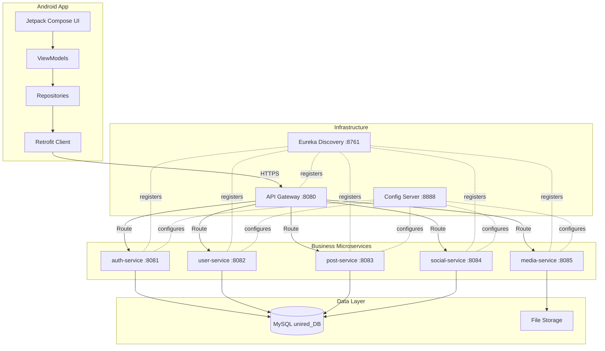

# UniRed — Microservices Social Network App

Build a social network Android app powered by a Kotlin/Spring Boot microservices backend, connecting to the existing `unired_DB` MySQL database.

---

## Existing State

| Asset | Status |
|-------|--------|
| MySQL Schema (`unired-db.sql`) | ✅ Complete — 8 tables, 15 stored procedures, 1 view, 1 trigger |
| API Gateway (`api-gateway/`) | ✅ Scaffolded — Spring Boot 4.0.6 + Spring Cloud Gateway (WebMVC), empty routes |
| Android App | ❌ Not started |
| Backend Microservices | ❌ Not started |

---

## Architecture Overview



---

## Technology Stack

### Backend
| Layer | Technology | Version |
|-------|-----------|---------|
| Language | Kotlin | 2.2.x |
| Framework | Spring Boot | 4.0.6 |
| Cloud | Spring Cloud | 2025.1.x |
| API Gateway | Spring Cloud Gateway (WebMVC) | 4.3.x |
| Service Discovery | Eureka Server/Client | — |
| Config | Spring Cloud Config Server | — |
| ORM | Spring Data JPA (Hibernate) | — |
| Database | MySQL 8+ | InnoDB, utf8mb4 |
| Auth | Spring Security + JWT (jjwt) | — |
| API Docs | SpringDoc OpenAPI | 2.x |
| Build | Gradle Kotlin DSL | 8.x |

### Android
| Layer | Technology |
|-------|-----------|
| Language | Kotlin |
| UI | Jetpack Compose (Material 3) |
| Architecture | MVVM + Clean Architecture |
| DI | Hilt |
| Networking | Retrofit + OkHttp + Kotlinx Serialization |
| Navigation | Navigation Compose (type-safe `@Serializable` routes) |
| Local Cache | Room |
| Image Loading | Coil |
| State | StateFlow + `collectAsStateWithLifecycle` |
| Async | Kotlin Coroutines + Flow |

---

## Project Directory Structure

```
unired-app/
├── docs/
│   └── database/
│       └── unired-db-docs.en.md          # ✅ exists
├── unired-db.sql                          # ✅ exists
│
├── api-gateway/                           # ✅ exists (needs route config)
│
├── discovery-server/                      # Eureka Server
├── config-server/                         # Spring Cloud Config
│
├── auth-service/                          # Authentication & JWT
├── user-service/                          # User profiles & management
├── post-service/                          # Posts, comments, likes
├── social-service/                        # Friends, friend requests
├── media-service/                         # Image upload/serving
│
├── config-repo/                           # External config files (Git)
│   ├── application.yml                    # shared defaults
│   ├── auth-service.yml
│   ├── user-service.yml
│   ├── post-service.yml
│   ├── social-service.yml
│   └── media-service.yml
│
└── unired-android/                        # Android app (Jetpack Compose)
    ├── app/
    ├── core/                              # Shared modules
    │   ├── network/
    │   ├── model/
    │   ├── ui/
    │   └── data/
    └── feature/
        ├── auth/
        ├── feed/
        ├── profile/
        ├── social/
        └── post/
```

---

## Open Questions

> [!IMPORTANT]
> **Database sharing strategy** — Should all microservices connect to the **same** `unired_DB` database (shared database pattern, which is simpler and matches your current single-schema setup), or should each service own its own schema/database (database-per-service pattern, which provides stricter isolation but requires schema splitting)?
>
> **Recommendation:** Given the existing schema with foreign key relationships across tables (e.g., `posts.user_id → users.user_id`), I recommend the **shared database** approach for Phase 1, with each service only accessing its own tables. This avoids breaking referential integrity while still maintaining logical service boundaries.

> [!IMPORTANT]
> **Image storage** — Where should uploaded images (profile pictures, post images) be stored?
> - **Option A:** Local filesystem (simplest, good for development)
> - **Option B:** MinIO (S3-compatible, self-hosted, production-ready)
> - **Option C:** Cloud storage (AWS S3, Google Cloud Storage)

> [!IMPORTANT]
> **Android minimum SDK** — What is the minimum Android version you want to support?
> - API 26 (Android 8.0) — covers ~95% of devices
> - API 29 (Android 10.0) — covers ~85% of devices, enables more modern APIs

> [!WARNING]
> **Stored procedures** — The database has 15 stored procedures. Spring Data JPA can call them via `@Procedure` annotations, but this ties business logic to the database layer. Do you want to:
> - **Keep them** and call from services (faster DB operations, logic stays in MySQL)
> - **Migrate to JPA queries** (logic in Kotlin, easier to test/maintain, portable)
> - **Hybrid** — keep complex ones (like `sp_register_user` with its duplicate check), migrate simple CRUD ones

---

## Phase 1 — Infrastructure Services (~2-3 days)

Set up the foundational infrastructure that all microservices depend on.

### 1.1 Discovery Server (Eureka)

#### [NEW] `discovery-server/`

Spring Boot app with `@EnableEurekaServer`. All microservices register here for automatic discovery.

**Key files:**
- `build.gradle.kts` — Spring Boot 4.0.6 + `spring-cloud-starter-netflix-eureka-server`
- `src/main/kotlin/.../DiscoveryServerApplication.kt` — `@EnableEurekaServer`
- `src/main/resources/application.yml`:
  ```yaml
  server:
    port: 8761
  eureka:
    client:
      register-with-eureka: false
      fetch-registry: false
  ```

### 1.2 Config Server

#### [NEW] `config-server/`

Centralized configuration server that serves YAML configs from the `config-repo/` directory.

**Key files:**
- `build.gradle.kts` — `spring-cloud-config-server`
- `src/main/kotlin/.../ConfigServerApplication.kt` — `@EnableConfigServer`
- `application.yml` — points to `config-repo/` (native profile for local file-based config)

### 1.3 Config Repository

#### [NEW] `config-repo/`

YAML configuration files for each service, containing database credentials, ports, and service-specific settings.

- `application.yml` — shared defaults (MySQL connection, JPA settings, Eureka client config)
- One file per service with specific overrides

### 1.4 API Gateway Configuration

#### [MODIFY] [api-gateway](file:///media/david/Storage/Dev/unired-app/api-gateway)

Update the existing gateway scaffold with:
- Eureka client registration
- Route definitions for all microservices
- JWT validation filter (global pre-filter)
- CORS configuration for mobile clients
- Rate limiting

```yaml
spring:
  cloud:
    gateway:
      routes:
        - id: auth-service
          uri: lb://auth-service
          predicates:
            - Path=/api/auth/**
          filters:
            - StripPrefix=1
        - id: user-service
          uri: lb://user-service
          predicates:
            - Path=/api/users/**
          filters:
            - StripPrefix=1
        # ... similar for post-service, social-service, media-service
```

---

## Phase 2 — Auth Service (~3-4 days)

### 2.1 Auth Service

#### [NEW] `auth-service/`

Handles registration, login, JWT token issuance, and token refresh.

**Dependencies:** Spring Web, Spring Security, Spring Data JPA, MySQL Connector, jjwt, Spring Cloud (Eureka Client, Config Client)

**Package structure:**
```
com.unired.auth/
├── config/          # SecurityConfig, JwtConfig
├── controller/      # AuthController
├── dto/             # RegisterRequest, LoginRequest, AuthResponse, TokenRefreshRequest
├── entity/          # User (JPA entity, maps to users table)
├── repository/      # UserRepository (Spring Data JPA)
├── security/        # JwtTokenProvider, JwtAuthFilter
├── service/         # AuthService
└── exception/       # Custom exceptions + GlobalExceptionHandler
```

**Endpoints:**
| Method | Path | Description | Auth |
|--------|------|-------------|------|
| POST | `/auth/register` | Register new user | Public |
| POST | `/auth/login` | Login, returns JWT | Public |
| POST | `/auth/refresh` | Refresh access token | Requires refresh token |
| POST | `/auth/logout` | Invalidate refresh token | Authenticated |

**Database tables accessed:** `users` (read/write)

**JWT Strategy:**
- Access token: short-lived (15 min), signed with HS512
- Refresh token: long-lived (7 days), stored in DB or in-memory cache
- Tokens carry: `userId`, `email`, `role`, `exp`

---

## Phase 3 — Core Business Services (~7-10 days)

### 3.1 User Service

#### [NEW] `user-service/`

User profile CRUD, search, and account management.

**Package structure:**
```
com.unired.user/
├── config/
├── controller/      # UserController
├── dto/             # UserProfileResponse, UpdateProfileRequest, UserSearchResult
├── entity/          # User, UserUpdateLog
├── repository/      # UserRepository, UserUpdateLogRepository
├── service/         # UserService
└── exception/
```

**Endpoints:**
| Method | Path | Description | Auth |
|--------|------|-------------|------|
| GET | `/users/me` | Get current user profile | Authenticated |
| GET | `/users/{id}` | Get user by ID | Authenticated |
| PUT | `/users/me` | Update profile (name, bio, pic) | Authenticated |
| DELETE | `/users/me` | Soft-delete account | Authenticated |
| GET | `/users/search?q={query}` | Search users by name | Authenticated |

**Database tables accessed:** `users` (read/write), `user_update_log` (read — trigger handles writes)

---

### 3.2 Post Service

#### [NEW] `post-service/`

Posts, comments, likes, and the feed.

**Package structure:**
```
com.unired.post/
├── config/
├── controller/      # PostController, CommentController, LikeController
├── dto/             # CreatePostRequest, PostResponse, PostStatsResponse,
│                    #   CreateCommentRequest, CommentResponse,
│                    #   LikeResponse
├── entity/          # Post, Comment, Like, HiddenComment
├── repository/      # PostRepository, CommentRepository, LikeRepository, HiddenCommentRepository
├── service/         # PostService, CommentService, LikeService
└── exception/
```

**Endpoints — Posts:**
| Method | Path | Description | Auth |
|--------|------|-------------|------|
| POST | `/posts` | Create post (text + optional image) | Authenticated |
| GET | `/posts/feed` | Get feed (paginated, newest first) | Authenticated |
| GET | `/posts/{id}` | Get single post with stats | Authenticated |
| PUT | `/posts/{id}` | Edit post content | Owner only |
| DELETE | `/posts/{id}` | Soft-delete post | Owner only |
| GET | `/posts/user/{userId}` | Get posts by user | Authenticated |

**Endpoints — Comments:**
| Method | Path | Description | Auth |
|--------|------|-------------|------|
| POST | `/posts/{id}/comments` | Add comment | Authenticated |
| GET | `/posts/{id}/comments` | List comments (paginated) | Authenticated |
| DELETE | `/comments/{id}` | Soft-delete comment | Owner only |
| POST | `/comments/{id}/hide` | Hide a comment | Authenticated |

**Endpoints — Likes:**
| Method | Path | Description | Auth |
|--------|------|-------------|------|
| POST | `/posts/{id}/like` | Like a post | Authenticated |
| DELETE | `/posts/{id}/like` | Unlike a post | Authenticated |
| GET | `/posts/{id}/likers` | Get users who liked | Authenticated |
| GET | `/posts/{id}/has-liked` | Check if current user liked | Authenticated |

**Database tables accessed:** `posts`, `comments`, `likes`, `hidden_comments`

> [!NOTE]
> The feed query will leverage the existing `v_posts_stats` view for efficient aggregation, or replicate its logic in a JPA `@Query` with pagination support.

---

### 3.3 Social Service

#### [NEW] `social-service/`

Friend requests and friendship management.

**Package structure:**
```
com.unired.social/
├── config/
├── controller/      # FriendRequestController, FriendController
├── dto/             # FriendRequestResponse, SendFriendRequest, FriendResponse
├── entity/          # FriendRequest, Friend
├── repository/      # FriendRequestRepository, FriendRepository
├── service/         # FriendRequestService, FriendService
└── exception/
```

**Endpoints — Friend Requests:**
| Method | Path | Description | Auth |
|--------|------|-------------|------|
| POST | `/friends/request/{userId}` | Send friend request | Authenticated |
| PUT | `/friends/request/{requestId}/accept` | Accept request | Receiver only |
| PUT | `/friends/request/{requestId}/reject` | Reject request | Receiver only |
| GET | `/friends/requests/pending` | List pending requests | Authenticated |
| GET | `/friends/requests/sent` | List sent requests | Authenticated |

**Endpoints — Friends:**
| Method | Path | Description | Auth |
|--------|------|-------------|------|
| GET | `/friends` | List my friends | Authenticated |
| GET | `/friends/{userId}` | List user's friends | Authenticated |
| DELETE | `/friends/{friendshipId}` | Remove friend | Either user |
| GET | `/friends/check/{userId}` | Check friendship status | Authenticated |

**Database tables accessed:** `friend_requests`, `friends`

---

### 3.4 Media Service

#### [NEW] `media-service/`

Image upload, processing, and serving. Decoupled from other services so storage backend can change independently.

**Endpoints:**
| Method | Path | Description | Auth |
|--------|------|-------------|------|
| POST | `/media/upload` | Upload image (multipart) | Authenticated |
| GET | `/media/{filename}` | Serve image file | Public |
| DELETE | `/media/{filename}` | Delete image | Owner / Admin |

Returns a URL/path that other services store as `profile_picture` or `image`.

---

## Phase 4 — Inter-Service Communication (~2-3 days)

### 4.1 User Context Propagation

The API Gateway validates JWT tokens and adds `X-User-Id` and `X-User-Role` headers to downstream requests. Each service reads these headers — no service needs to validate JWT independently.

### 4.2 Service-to-Service Calls (OpenFeign)

When one service needs data from another (e.g., post-service needs author names from user-service), use Spring Cloud OpenFeign:

```kotlin
@FeignClient(name = "user-service")
interface UserClient {
    @GetMapping("/users/{id}")
    fun getUserById(@PathVariable id: Long): UserDto
}
```

### 4.3 Shared DTOs

Create a lightweight shared library (`unired-common`) published to the local Maven repo containing:
- Common DTOs (UserSummary, PaginatedResponse, ErrorResponse)
- Custom exception classes
- JWT utility constants

---

## Phase 5 — Android App Foundation (~5-7 days)

### 5.1 Project Setup

#### [NEW] `unired-android/`

Create with Android Studio using the "Empty Compose Activity" template. Configure multi-module Gradle structure.

**Module structure:**
```
unired-android/
├── app/                          # Application module (entry point, DI setup, navigation)
├── core/
│   ├── network/                  # Retrofit setup, API interfaces, auth interceptor
│   ├── model/                    # Shared data models / DTOs
│   ├── data/                     # Repositories (implementations)
│   ├── domain/                   # Use cases (optional, for complex business logic)
│   ├── ui/                       # Shared composables, theme, design system
│   └── datastore/                # DataStore preferences (token storage)
└── feature/
    ├── auth/                     # Login & Register screens + ViewModel
    ├── feed/                     # Feed screen + ViewModel
    ├── post/                     # Post detail, create post + ViewModel
    ├── profile/                  # Profile view/edit + ViewModel
    └── social/                   # Friends, friend requests + ViewModel
```

### 5.2 Core Network Layer

```kotlin
// core/network — Retrofit setup
@Module
@InstallIn(SingletonComponent::class)
object NetworkModule {
    @Provides @Singleton
    fun provideRetrofit(authInterceptor: AuthInterceptor): Retrofit {
        return Retrofit.Builder()
            .baseUrl(BuildConfig.API_BASE_URL)  // points to API Gateway
            .addConverterFactory(Json.asConverterFactory("application/json".toMediaType()))
            .client(OkHttpClient.Builder()
                .addInterceptor(authInterceptor)  // auto-attaches JWT
                .addInterceptor(HttpLoggingInterceptor())
                .build())
            .build()
    }
}
```

### 5.3 Navigation Graph (Type-Safe Routes)

```kotlin
@Serializable object Login
@Serializable object Register
@Serializable object Feed
@Serializable data class PostDetail(val postId: Int)
@Serializable data class UserProfile(val userId: Int)
@Serializable object Friends
@Serializable object FriendRequests
@Serializable object CreatePost
@Serializable object EditProfile
@Serializable object Search
```

### 5.4 Authentication Flow

```
App Launch
    │
    ├── Token in DataStore? ──No──▸ LoginScreen
    │                                  │
    │                          Login/Register
    │                                  │
    │                         ◂── JWT Saved ──▸
    │
    ├── Token expired? ──Yes──▸ Refresh Token
    │                              │
    │                   ┌──Success──┘──Failure──▸ LoginScreen
    │                   │
    └── Valid token ────▸ FeedScreen (home)
```

---

## Phase 6 — Android Feature Screens (~10-14 days)

### 6.1 Auth Screens
- **LoginScreen** — Email + password fields, "Remember me", link to register
- **RegisterScreen** — Full name, email, password, confirm password

### 6.2 Feed Screen (Home)
- Scrollable list of posts (LazyColumn)
- Each post card shows: author avatar + name, content, image (optional), like count + button, comment count, timestamp
- Pull-to-refresh, infinite scroll pagination
- FAB to create new post

### 6.3 Post Detail Screen
- Full post content + image
- Comment list
- Add comment input
- Like/unlike toggle
- Owner can edit/delete

### 6.4 Profile Screen
- View any user's profile: avatar, name, bio, post count, friend count
- Own profile: edit name, bio, change profile picture (camera/gallery picker)
- Tab: user's posts

### 6.5 Social Screens
- **Friends List** — grid/list of friends with avatar + name, tap to view profile
- **Friend Requests** — pending incoming requests with accept/reject, sent requests
- **Search** — search users by name, send friend request from results

### 6.6 Create/Edit Post Screen
- Text input for content
- Image picker (gallery/camera)
- Upload progress indicator
- Preview before posting

---

## Phase 7 — Polish & Deployment (~3-5 days)

### 7.1 Backend
- [ ] Dockerize each service with `Dockerfile` + `docker-compose.yml` for the full stack
- [ ] Add health checks via Spring Boot Actuator
- [ ] API documentation with SpringDoc/Swagger UI
- [ ] Request validation (`@Valid` + Bean Validation)
- [ ] Pagination for all list endpoints (Spring Data `Pageable`)
- [ ] Error handling standardization (RFC 7807 Problem Details)

### 7.2 Android
- [ ] Offline-first caching with Room for feed posts
- [ ] Push notifications (Firebase Cloud Messaging — optional stretch)
- [ ] Dark mode support
- [ ] Loading skeletons & animations
- [ ] Error states & retry UI
- [ ] ProGuard/R8 configuration

### 7.3 Docker Compose

```yaml
services:
  mysql:
    image: mysql:8
    environment:
      MYSQL_DATABASE: unired_DB
    volumes:
      - ./unired-db.sql:/docker-entrypoint-initdb.d/init.sql
    ports: ["3306:3306"]

  discovery-server:
    build: ./discovery-server
    ports: ["8761:8761"]

  config-server:
    build: ./config-server
    ports: ["8888:8888"]
    depends_on: [discovery-server]

  api-gateway:
    build: ./api-gateway
    ports: ["8080:8080"]
    depends_on: [discovery-server, config-server]

  auth-service:
    build: ./auth-service
    depends_on: [mysql, discovery-server, config-server]

  user-service:
    build: ./user-service
    depends_on: [mysql, discovery-server, config-server]

  post-service:
    build: ./post-service
    depends_on: [mysql, discovery-server, config-server]

  social-service:
    build: ./social-service
    depends_on: [mysql, discovery-server, config-server]

  media-service:
    build: ./media-service
    depends_on: [discovery-server, config-server]
```

---

## Verification Plan

### Automated Tests
- **Unit tests** per service — service layer + repository layer with `@DataJpaTest` and H2/Testcontainers
- **Integration tests** — `@SpringBootTest` with `WebTestClient` for each REST endpoint
- **API Gateway** — route resolution tests
- **Android** — Compose UI tests with `createComposeRule()`, ViewModel unit tests with `turbine`

### Manual Verification
- Start all services with Docker Compose, verify Eureka dashboard shows all registered services
- Test full auth flow: register → login → receive JWT → access protected endpoints
- Test from Android app: register, create post, like, comment, send friend request, accept
- Verify stored procedures are properly called (or migrated) by checking `user_update_log` entries after profile edits

---

## Recommended Build Order

| Step | What to build | Depends on |
|------|--------------|------------|
| **1** | Discovery Server + Config Server | — |
| **2** | Auth Service | Step 1 |
| **3** | API Gateway routes + JWT filter | Steps 1-2 |
| **4** | User Service | Steps 1-3 |
| **5** | Post Service | Steps 1-3 |
| **6** | Social Service | Steps 1-3 |
| **7** | Media Service | Steps 1-3 |
| **8** | Android: core modules (network, model, DI) | Steps 1-3 (backend running) |
| **9** | Android: auth feature | Step 8 |
| **10** | Android: feed + post detail | Steps 5, 8 |
| **11** | Android: profile | Steps 4, 7, 8 |
| **12** | Android: social (friends) | Steps 6, 8 |
| **13** | Docker Compose + Polish | All above |

> [!TIP]
> **Estimated total time:** 30-45 days for a solo developer. Phases 1-4 (backend) and Phases 5-6 (Android) can partially overlap once auth-service and API Gateway are functional.
