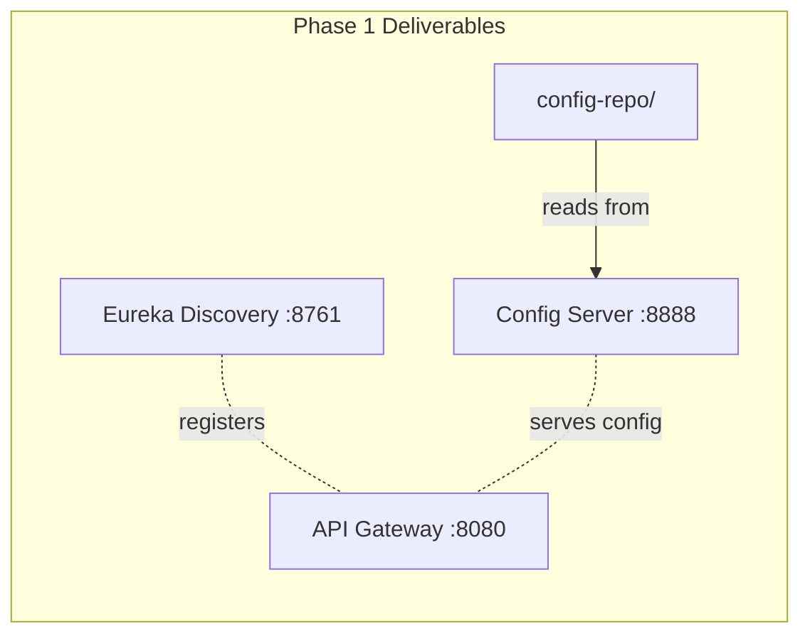
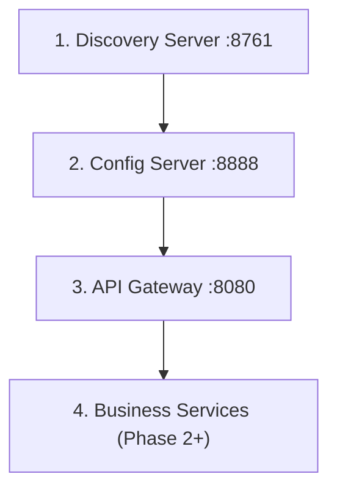

# Phase 1 — Infrastructure Services

**Estimated Duration:** 2–3 days  
**Dependencies:** None (foundation layer)  
**Deliverables:** Eureka Discovery Server, Config Server, Config Repository, API Gateway route configuration

---

## Overview

This phase establishes the foundational infrastructure that every microservice depends on. No business logic is built here — just the "plumbing" that enables service registration, centralized configuration, and intelligent routing.



---

## Prerequisites

| Prerequisite | Status | Notes |
|---|---|---|
| JDK 17+ installed | Verify | `java -version` |
| Gradle 8.x installed | Verify | Can use wrapper (`./gradlew`) |
| MySQL 8+ running | Verify | `unired_DB` schema loaded from `unired-db.sql` |
| Spring Boot 4.0.6 compatible | ✅ | Matches existing `api-gateway/build.gradle.kts` |
| Spring Cloud 2025.1.x BOM | ✅ | Already declared in `api-gateway` |

---

## Task 1.1 — Discovery Server (Eureka)

**Objective:** Create a Spring Boot application that acts as a service registry. All microservices will register here on startup, enabling discovery-based routing (no hardcoded URLs).

### 1.1.1 — Project Scaffolding

Create `discovery-server/` at the project root with the following structure:

```
discovery-server/
├── build.gradle.kts
├── settings.gradle.kts
├── src/
│   └── main/
│       ├── kotlin/
│       │   └── com/unired/discovery/
│       │       └── DiscoveryServerApplication.kt
│       └── resources/
│           └── application.yml
```

### 1.1.2 — `build.gradle.kts`

```kotlin
plugins {
    kotlin("jvm") version "2.2.21"
    kotlin("plugin.spring") version "2.2.21"
    id("org.springframework.boot") version "4.0.6"
    id("io.spring.dependency-management") version "1.1.7"
}

group = "com.unired"
version = "0.0.1-SNAPSHOT"

java {
    toolchain {
        languageVersion = JavaLanguageVersion.of(17)
    }
}

repositories {
    mavenCentral()
}

extra["springCloudVersion"] = "2025.1.1"

dependencies {
    implementation("org.springframework.cloud:spring-cloud-starter-netflix-eureka-server")
    implementation("org.jetbrains.kotlin:kotlin-reflect")
    testImplementation("org.springframework.boot:spring-boot-starter-test")
}

dependencyManagement {
    imports {
        mavenBom("org.springframework.cloud:spring-cloud-dependencies:${property("springCloudVersion")}")
    }
}

kotlin {
    compilerOptions {
        freeCompilerArgs.addAll("-Xjsr305=strict", "-Xannotation-default-target=param-property")
    }
}

tasks.withType<Test> {
    useJUnitPlatform()
}
```

**Key decisions:**
- Kotlin version `2.2.21` matches `api-gateway`
- Spring Boot `4.0.6` and Cloud `2025.1.1` match existing versions
- Only the Eureka Server starter is needed — no web, no security

### 1.1.3 — Application Class

```kotlin
// src/main/kotlin/com/unired/discovery/DiscoveryServerApplication.kt
package com.unired.discovery

import org.springframework.boot.autoconfigure.SpringBootApplication
import org.springframework.boot.runApplication
import org.springframework.cloud.netflix.eureka.server.EnableEurekaServer

@SpringBootApplication
@EnableEurekaServer
class DiscoveryServerApplication

fun main(args: Array<String>) {
    runApplication<DiscoveryServerApplication>(*args)
}
```

### 1.1.4 — `application.yml`

```yaml
server:
  port: 8761

spring:
  application:
    name: discovery-server

eureka:
  client:
    register-with-eureka: false    # Eureka doesn't register with itself
    fetch-registry: false          # Eureka doesn't fetch from itself
  server:
    enable-self-preservation: false # Disable for dev (removes stale instances faster)
    eviction-interval-timer-in-ms: 5000
```

**Configuration rationale:**
- `register-with-eureka: false` — The discovery server itself should not register as a client
- `enable-self-preservation: false` — In development, we want stale service entries cleaned up quickly. Re-enable in production.

### 1.1.5 — Verification

```bash
cd discovery-server
./gradlew bootRun
```

- **Expected:** Server starts on `:8761`
- **Test:** Open `http://localhost:8761` → Eureka dashboard loads, shows "No instances available" (correct — no services registered yet)
- **Log confirmation:** `Started DiscoveryServerApplication in X seconds`

---

## Task 1.2 — Config Server

**Objective:** Create a centralized configuration server that reads YAML files from the local `config-repo/` directory and serves them to microservices at startup.

### 1.2.1 — Project Scaffolding

```
config-server/
├── build.gradle.kts
├── settings.gradle.kts
├── src/
│   └── main/
│       ├── kotlin/
│       │   └── com/unired/config/
│       │       └── ConfigServerApplication.kt
│       └── resources/
│           └── application.yml
```

### 1.2.2 — `build.gradle.kts`

```kotlin
plugins {
    kotlin("jvm") version "2.2.21"
    kotlin("plugin.spring") version "2.2.21"
    id("org.springframework.boot") version "4.0.6"
    id("io.spring.dependency-management") version "1.1.7"
}

group = "com.unired"
version = "0.0.1-SNAPSHOT"

java {
    toolchain {
        languageVersion = JavaLanguageVersion.of(17)
    }
}

repositories {
    mavenCentral()
}

extra["springCloudVersion"] = "2025.1.1"

dependencies {
    implementation("org.springframework.cloud:spring-cloud-config-server")
    implementation("org.springframework.cloud:spring-cloud-starter-netflix-eureka-client")
    implementation("org.jetbrains.kotlin:kotlin-reflect")
    testImplementation("org.springframework.boot:spring-boot-starter-test")
}

dependencyManagement {
    imports {
        mavenBom("org.springframework.cloud:spring-cloud-dependencies:${property("springCloudVersion")}")
    }
}

kotlin {
    compilerOptions {
        freeCompilerArgs.addAll("-Xjsr305=strict", "-Xannotation-default-target=param-property")
    }
}

tasks.withType<Test> {
    useJUnitPlatform()
}
```

**Key decisions:**
- Includes `eureka-client` so Config Server registers with Eureka — services can then find Config Server via discovery instead of hardcoded URL
- Uses `native` profile to read config from the local filesystem (not Git — simpler for development)

### 1.2.3 — Application Class

```kotlin
// src/main/kotlin/com/unired/config/ConfigServerApplication.kt
package com.unired.config

import org.springframework.boot.autoconfigure.SpringBootApplication
import org.springframework.boot.runApplication
import org.springframework.cloud.config.server.EnableConfigServer

@SpringBootApplication
@EnableConfigServer
class ConfigServerApplication

fun main(args: Array<String>) {
    runApplication<ConfigServerApplication>(*args)
}
```

### 1.2.4 — `application.yml`

```yaml
server:
  port: 8888

spring:
  application:
    name: config-server
  profiles:
    active: native                          # Reads from local files, not Git
  cloud:
    config:
      server:
        native:
          search-locations: file:///${user.dir}/../config-repo  # Relative to project root

eureka:
  client:
    service-url:
      defaultZone: http://localhost:8761/eureka
  instance:
    prefer-ip-address: true
```

**Configuration rationale:**
- `native` profile reads from local directory — avoids Git setup for development
- `search-locations` uses `file:///` + relative path to point to the `config-repo/` sibling directory
- Registers with Eureka so other services can discover it

### 1.2.5 — Verification

```bash
cd config-server
./gradlew bootRun
```

- **Prerequisite:** Discovery Server must be running on `:8761`
- **Expected:** Server starts on `:8888`, registers with Eureka
- **Test:** `curl http://localhost:8888/auth-service/default` → returns config JSON (after config-repo is populated)
- **Eureka check:** `http://localhost:8761` → "CONFIG-SERVER" appears in registered instances

---

## Task 1.3 — Config Repository

**Objective:** Create YAML configuration files for all microservices. Services pull these configs from Config Server at startup, ensuring centralized and consistent configuration.

### 1.3.1 — Directory Structure

```
config-repo/
├── application.yml              # Shared defaults for ALL services
├── auth-service.yml
├── user-service.yml
├── post-service.yml
├── social-service.yml
├── media-service.yml
└── api-gateway.yml
```

### 1.3.2 — `application.yml` (Shared Defaults)

This file is loaded by **every** service. Contains common database, JPA, and Eureka client settings.

```yaml
# Shared configuration for all microservices

spring:
  datasource:
    url: jdbc:mysql://localhost:3306/unired_DB?useSSL=false&serverTimezone=UTC&allowPublicKeyRetrieval=true
    username: root
    password: ${MYSQL_PASSWORD:root}       # Override via env var in production
    driver-class-name: com.mysql.cj.jdbc.Driver
  jpa:
    hibernate:
      ddl-auto: validate                   # Schema managed by unired-db.sql, not Hibernate
    properties:
      hibernate:
        dialect: org.hibernate.dialect.MySQLDialect
        format_sql: true
    show-sql: false                         # Set to true for debugging
    open-in-view: false                     # Avoid lazy loading issues in controllers

eureka:
  client:
    service-url:
      defaultZone: http://localhost:8761/eureka
  instance:
    prefer-ip-address: true

management:
  endpoints:
    web:
      exposure:
        include: health,info,metrics
  endpoint:
    health:
      show-details: when-authorized

logging:
  level:
    com.unired: DEBUG
    org.springframework.web: INFO
    org.hibernate.SQL: WARN
```

**Design decisions:**
- `ddl-auto: validate` — The schema is managed by `unired-db.sql`, not by Hibernate auto-DDL. Validate ensures JPA entities match the actual schema at startup.
- `open-in-view: false` — Prevents lazy loading gotchas by requiring explicit fetching in the service layer
- `${MYSQL_PASSWORD:root}` — Uses environment variable with fallback for dev

### 1.3.3 — Service-Specific Config Files

#### `auth-service.yml`
```yaml
server:
  port: 8081

spring:
  application:
    name: auth-service

jwt:
  secret: ${JWT_SECRET:your-256-bit-secret-key-for-development-only-change-in-prod}
  access-token-expiration: 900000          # 15 minutes in ms
  refresh-token-expiration: 604800000      # 7 days in ms
```

#### `user-service.yml`
```yaml
server:
  port: 8082

spring:
  application:
    name: user-service
```

#### `post-service.yml`
```yaml
server:
  port: 8083

spring:
  application:
    name: post-service

feed:
  default-page-size: 20
  max-page-size: 50
```

#### `social-service.yml`
```yaml
server:
  port: 8084

spring:
  application:
    name: social-service
```

#### `media-service.yml`
```yaml
server:
  port: 8085

spring:
  application:
    name: media-service

media:
  upload-dir: ${MEDIA_UPLOAD_DIR:./uploads}
  max-file-size: 10MB
  allowed-types: image/jpeg,image/png,image/webp,image/gif
```

#### `api-gateway.yml`
```yaml
server:
  port: 8080

spring:
  application:
    name: api-gateway
```

### 1.3.4 — Verification

After Config Server is running:

```bash
# Test that shared config is resolved
curl http://localhost:8888/auth-service/default | jq .

# Expected: merged config from application.yml + auth-service.yml
# Should see port 8081, JWT settings, and shared datasource config
```

---

## Task 1.4 — API Gateway Configuration

**Objective:** Update the existing `api-gateway/` scaffold with Eureka registration, route definitions for all microservices, JWT validation filter, and CORS configuration.

### 1.4.1 — Update `build.gradle.kts`

Add the following dependencies to the existing `api-gateway/build.gradle.kts`:

```diff
 dependencies {
     implementation("org.springframework.boot:spring-boot-starter-actuator")
-    implementation("org.springframework.boot:spring-boot-starter-webflux")
-    implementation("io.projectreactor.kotlin:reactor-kotlin-extensions")
     implementation("org.jetbrains.kotlin:kotlin-reflect")
-    implementation("org.jetbrains.kotlinx:kotlinx-coroutines-reactor")
     implementation("org.springframework.cloud:spring-cloud-starter-gateway-server-webmvc")
     implementation("tools.jackson.module:jackson-module-kotlin")
+    implementation("org.springframework.cloud:spring-cloud-starter-netflix-eureka-client")
+    implementation("org.springframework.cloud:spring-cloud-starter-config")
+    implementation("io.jsonwebtoken:jjwt-api:0.12.6")
+    runtimeOnly("io.jsonwebtoken:jjwt-impl:0.12.6")
+    runtimeOnly("io.jsonwebtoken:jjwt-jackson:0.12.6")
     // ... test deps
 }
```

**Rationale:**
- `eureka-client` — Gateway registers with Eureka and discovers backend services
- `spring-cloud-starter-config` — Pulls config from Config Server
- `jjwt` — JWT token parsing for the auth filter (validates tokens, extracts claims, injects `X-User-*` headers)
- Remove `webflux` — Gateway uses WebMVC mode (already declared via `gateway-server-webmvc`)

### 1.4.2 — Route Configuration (`application.yml`)

Replace or update `src/main/resources/application.yml`:

```yaml
server:
  port: 8080

spring:
  application:
    name: api-gateway
  config:
    import: optional:configserver:http://localhost:8888
  cloud:
    gateway:
      routes:
        # Auth Service — public endpoints (no JWT filter)
        - id: auth-service
          uri: lb://auth-service
          predicates:
            - Path=/api/auth/**
          filters:
            - StripPrefix=1

        # User Service
        - id: user-service
          uri: lb://user-service
          predicates:
            - Path=/api/users/**
          filters:
            - StripPrefix=1

        # Post Service
        - id: post-service
          uri: lb://post-service
          predicates:
            - Path=/api/posts/**,/api/comments/**
          filters:
            - StripPrefix=1

        # Social Service
        - id: social-service
          uri: lb://social-service
          predicates:
            - Path=/api/friends/**
          filters:
            - StripPrefix=1

        # Media Service
        - id: media-service
          uri: lb://media-service
          predicates:
            - Path=/api/media/**
          filters:
            - StripPrefix=1

eureka:
  client:
    service-url:
      defaultZone: http://localhost:8761/eureka
  instance:
    prefer-ip-address: true
```

**Routing logic:**
| Incoming Request | Routed To | Example |
|---|---|---|
| `GET /api/auth/login` | `auth-service → /auth/login` | `StripPrefix=1` removes `/api` |
| `GET /api/users/me` | `user-service → /users/me` | |
| `GET /api/posts/feed` | `post-service → /posts/feed` | |
| `POST /api/friends/request/5` | `social-service → /friends/request/5` | |
| `POST /api/media/upload` | `media-service → /media/upload` | |

### 1.4.3 — JWT Authentication Filter

Create a global pre-filter that validates JWT tokens on all routes except public ones (auth endpoints).

```kotlin
// src/main/kotlin/com/unired/gateway/filter/JwtAuthFilter.kt
package com.unired.gateway.filter

import io.jsonwebtoken.Claims
import io.jsonwebtoken.Jwts
import io.jsonwebtoken.security.Keys
import jakarta.servlet.FilterChain
import jakarta.servlet.http.HttpServletRequest
import jakarta.servlet.http.HttpServletResponse
import org.springframework.beans.factory.annotation.Value
import org.springframework.http.HttpStatus
import org.springframework.stereotype.Component
import org.springframework.web.filter.OncePerRequestFilter

@Component
class JwtAuthFilter(
    @Value("\${jwt.secret}") private val jwtSecret: String
) : OncePerRequestFilter() {

    private val publicPaths = listOf(
        "/api/auth/login",
        "/api/auth/register",
        "/api/media/"                     // Media serving is public (GET only)
    )

    override fun shouldNotFilter(request: HttpServletRequest): Boolean {
        val path = request.requestURI
        return publicPaths.any { path.startsWith(it) }
    }

    override fun doFilterInternal(
        request: HttpServletRequest,
        response: HttpServletResponse,
        filterChain: FilterChain
    ) {
        val authHeader = request.getHeader("Authorization")

        if (authHeader == null || !authHeader.startsWith("Bearer ")) {
            response.sendError(HttpStatus.UNAUTHORIZED.value(), "Missing or invalid Authorization header")
            return
        }

        try {
            val token = authHeader.substring(7)
            val key = Keys.hmacShaKeyFor(jwtSecret.toByteArray())
            val claims: Claims = Jwts.parser()
                .verifyWith(key)
                .build()
                .parseSignedClaims(token)
                .payload

            // Inject user context headers for downstream services
            val mutableRequest = MutableHttpServletRequest(request)
            mutableRequest.putHeader("X-User-Id", claims.subject)
            mutableRequest.putHeader("X-User-Email", claims["email"] as? String ?: "")
            mutableRequest.putHeader("X-User-Role", claims["role"] as? String ?: "user")

            filterChain.doFilter(mutableRequest, response)
        } catch (e: Exception) {
            response.sendError(HttpStatus.UNAUTHORIZED.value(), "Invalid or expired token")
        }
    }
}
```

### 1.4.4 — Mutable Request Wrapper

```kotlin
// src/main/kotlin/com/unired/gateway/filter/MutableHttpServletRequest.kt
package com.unired.gateway.filter

import jakarta.servlet.http.HttpServletRequest
import jakarta.servlet.http.HttpServletRequestWrapper

class MutableHttpServletRequest(request: HttpServletRequest) : HttpServletRequestWrapper(request) {

    private val customHeaders = mutableMapOf<String, String>()

    fun putHeader(name: String, value: String) {
        customHeaders[name] = value
    }

    override fun getHeader(name: String): String? {
        return customHeaders[name] ?: super.getHeader(name)
    }

    override fun getHeaderNames(): java.util.Enumeration<String> {
        val names = mutableSetOf<String>()
        names.addAll(customHeaders.keys)
        val originalNames = super.getHeaderNames()
        while (originalNames.hasMoreElements()) {
            names.add(originalNames.nextElement())
        }
        return java.util.Collections.enumeration(names)
    }
}
```

### 1.4.5 — CORS Configuration

```kotlin
// src/main/kotlin/com/unired/gateway/config/CorsConfig.kt
package com.unired.gateway.config

import org.springframework.context.annotation.Bean
import org.springframework.context.annotation.Configuration
import org.springframework.web.cors.CorsConfiguration
import org.springframework.web.cors.UrlBasedCorsConfigurationSource
import org.springframework.web.filter.CorsFilter

@Configuration
class CorsConfig {

    @Bean
    fun corsFilter(): CorsFilter {
        val config = CorsConfiguration().apply {
            allowedOriginPatterns = listOf("*")           // Restrict in production
            allowedMethods = listOf("GET", "POST", "PUT", "DELETE", "OPTIONS")
            allowedHeaders = listOf("*")
            allowCredentials = true
            maxAge = 3600L
        }
        val source = UrlBasedCorsConfigurationSource()
        source.registerCorsConfiguration("/**", config)
        return CorsFilter(source)
    }
}
```

### 1.4.6 — Verification

```bash
cd api-gateway
./gradlew bootRun
```

- **Prerequisites:** Discovery Server (:8761) and Config Server (:8888) must be running
- **Expected:** Gateway starts on `:8080`, registers with Eureka
- **Test:** `curl http://localhost:8080/api/auth/login` → 503 (auth-service not yet running, but route resolves)
- **Eureka check:** `http://localhost:8761` → "API-GATEWAY" appears

---

## Startup Order

Services must be started in this order:



| Step | Service | Command | Wait Until |
|------|---------|---------|------------|
| 1 | Discovery Server | `cd discovery-server && ./gradlew bootRun` | Eureka dashboard loads at `:8761` |
| 2 | Config Server | `cd config-server && ./gradlew bootRun` | Registered in Eureka dashboard |
| 3 | API Gateway | `cd api-gateway && ./gradlew bootRun` | Registered in Eureka dashboard |

---

## Acceptance Criteria

- [ ] Discovery Server runs on `:8761` and shows its web dashboard
- [ ] Config Server runs on `:8888`, registers with Eureka, and serves config from `config-repo/`
- [ ] `curl http://localhost:8888/auth-service/default` returns merged YAML config
- [ ] API Gateway runs on `:8080`, registers with Eureka
- [ ] API Gateway routes are defined for all 5 microservices
- [ ] JWT filter skips public endpoints (`/api/auth/login`, `/api/auth/register`)
- [ ] JWT filter returns 401 for requests without `Authorization` header to protected routes
- [ ] CORS headers are present in preflight responses
- [ ] All three services appear in the Eureka dashboard

---

## Risk & Mitigation

| Risk | Impact | Mitigation |
|------|--------|------------|
| Spring Cloud version mismatch | Build failures | Pin all services to `2025.1.1`, same as existing `api-gateway` |
| Config Server path resolution | Config not found | Use absolute path fallback: `file:///absolute/path/to/config-repo` |
| Eureka self-preservation in dev | Stale services shown | Disable with `enable-self-preservation: false` |
| Port conflicts | Service won't start | Document all ports, check availability before starting |

---

## Files Created/Modified Summary

| Action | Path | Purpose |
|--------|------|---------|
| **[NEW]** | `discovery-server/` | Eureka Server (6 files) |
| **[NEW]** | `config-server/` | Config Server (6 files) |
| **[NEW]** | `config-repo/` | 7 YAML config files |
| **[MODIFY]** | `api-gateway/build.gradle.kts` | Add eureka, config, jjwt deps |
| **[MODIFY]** | `api-gateway/src/.../application.yml` | Route definitions |
| **[NEW]** | `api-gateway/src/.../filter/JwtAuthFilter.kt` | JWT validation |
| **[NEW]** | `api-gateway/src/.../filter/MutableHttpServletRequest.kt` | Header injection |
| **[NEW]** | `api-gateway/src/.../config/CorsConfig.kt` | CORS setup |
