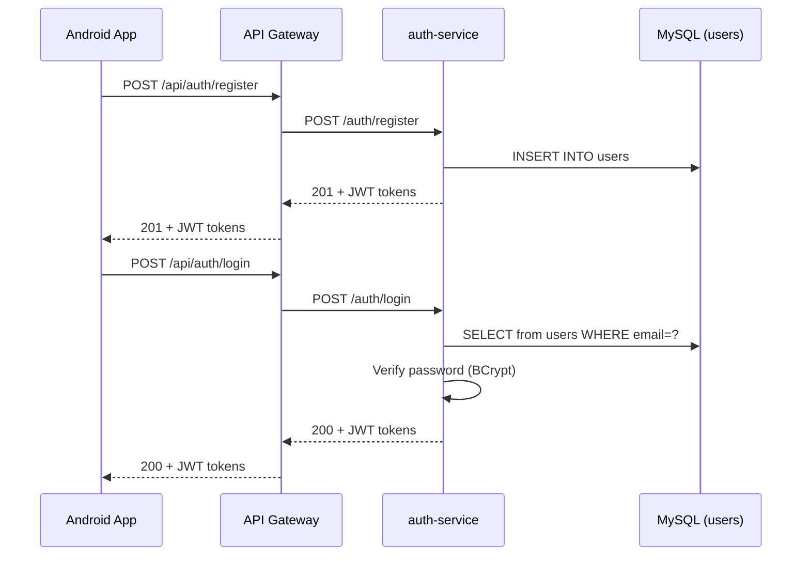

# Phase 2 — Auth Service

**Estimated Duration:** 3–4 days  
**Dependencies:** Phase 1 (Discovery Server, Config Server, API Gateway running)  
**Deliverables:** Fully functional `auth-service/` with registration, login, JWT issuance, and token refresh

---

## Overview

This phase builds the authentication microservice — the first business service in the stack. It handles user registration, login, JWT token issuance, and token refresh. Every subsequent service depends on the auth flow being in place.



---

## Prerequisites

| Prerequisite | Details |
|---|---|
| Phase 1 complete | Discovery `:8761`, Config `:8888`, Gateway `:8080` all running |
| MySQL running | `unired_DB` schema loaded, `users` table exists |
| Config repo populated | `auth-service.yml` with JWT secret and token expiration values |

---

## Task 2.1 — Project Scaffolding

### 2.1.1 — Directory Structure

```
auth-service/
├── build.gradle.kts
├── settings.gradle.kts
├── src/
│   ├── main/
│   │   ├── kotlin/com/unired/auth/
│   │   │   ├── AuthServiceApplication.kt
│   │   │   ├── config/
│   │   │   │   ├── SecurityConfig.kt
│   │   │   │   └── JwtConfig.kt
│   │   │   ├── controller/
│   │   │   │   └── AuthController.kt
│   │   │   ├── dto/
│   │   │   │   ├── RegisterRequest.kt
│   │   │   │   ├── LoginRequest.kt
│   │   │   │   ├── AuthResponse.kt
│   │   │   │   └── TokenRefreshRequest.kt
│   │   │   ├── entity/
│   │   │   │   └── User.kt
│   │   │   ├── repository/
│   │   │   │   └── UserRepository.kt
│   │   │   ├── security/
│   │   │   │   └── JwtTokenProvider.kt
│   │   │   ├── service/
│   │   │   │   └── AuthService.kt
│   │   │   └── exception/
│   │   │       ├── AuthException.kt
│   │   │       └── GlobalExceptionHandler.kt
│   │   └── resources/
│   │       └── application.yml
│   └── test/
│       └── kotlin/com/unired/auth/
│           ├── service/AuthServiceTest.kt
│           └── controller/AuthControllerTest.kt
```

### 2.1.2 — `build.gradle.kts`

```kotlin
plugins {
    kotlin("jvm") version "2.2.21"
    kotlin("plugin.spring") version "2.2.21"
    kotlin("plugin.jpa") version "2.2.21"
    id("org.springframework.boot") version "4.0.6"
    id("io.spring.dependency-management") version "1.1.7"
}

group = "com.unired"
version = "0.0.1-SNAPSHOT"

java {
    toolchain {
        languageVersion = JavaLanguageVersion.of(17)
    }
}

repositories { mavenCentral() }

extra["springCloudVersion"] = "2025.1.1"

dependencies {
    // Spring Boot
    implementation("org.springframework.boot:spring-boot-starter-web")
    implementation("org.springframework.boot:spring-boot-starter-data-jpa")
    implementation("org.springframework.boot:spring-boot-starter-security")
    implementation("org.springframework.boot:spring-boot-starter-validation")
    implementation("org.springframework.boot:spring-boot-starter-actuator")

    // Spring Cloud
    implementation("org.springframework.cloud:spring-cloud-starter-netflix-eureka-client")
    implementation("org.springframework.cloud:spring-cloud-starter-config")

    // JWT
    implementation("io.jsonwebtoken:jjwt-api:0.12.6")
    runtimeOnly("io.jsonwebtoken:jjwt-impl:0.12.6")
    runtimeOnly("io.jsonwebtoken:jjwt-jackson:0.12.6")

    // Database
    runtimeOnly("com.mysql:mysql-connector-j")

    // Kotlin
    implementation("org.jetbrains.kotlin:kotlin-reflect")
    implementation("tools.jackson.module:jackson-module-kotlin")

    // Test
    testImplementation("org.springframework.boot:spring-boot-starter-test")
    testImplementation("org.springframework.security:spring-security-test")
    testImplementation("com.h2database:h2")
}

dependencyManagement {
    imports {
        mavenBom("org.springframework.cloud:spring-cloud-dependencies:${property("springCloudVersion")}")
    }
}
```

**Key decisions:**
- `plugin.jpa` — enables no-arg constructors for JPA entities in Kotlin
- `spring-boot-starter-validation` — for `@Valid` request body validation
- `h2` in test scope — in-memory DB for unit tests without MySQL dependency

---

## Task 2.2 — JPA Entity

### 2.2.1 — `User.kt` Entity

Maps to the existing `users` table in `unired_DB`. Must match the schema exactly since `ddl-auto: validate`.

```kotlin
// entity/User.kt
@Entity
@Table(name = "users")
class User(
    @Id @GeneratedValue(strategy = GenerationType.IDENTITY)
    @Column(name = "user_id")
    val userId: Int = 0,

    @Column(name = "full_name", nullable = false, length = 100)
    var fullName: String,

    @Column(name = "biography", columnDefinition = "TEXT")
    var biography: String? = null,

    @Column(name = "profile_picture", length = 255)
    var profilePicture: String = "default_avatar.png",

    @Column(name = "email", nullable = false, unique = true, length = 100)
    val email: String,

    @Column(name = "password", nullable = false, length = 255)
    var password: String,

    @Column(name = "registration_date")
    val registrationDate: LocalDateTime = LocalDateTime.now(),

    @Column(name = "role", length = 20)
    var role: String = "user",

    @Column(name = "active")
    var active: Boolean = true,

    @Column(name = "updated_at")
    var updatedAt: LocalDateTime = LocalDateTime.now()
)
```

**Column mapping notes:**
- All column names use `@Column(name = ...)` to match the snake_case MySQL schema
- `userId` is `Int` to match `INT AUTO_INCREMENT` in MySQL
- `biography` and `profilePicture` are nullable with defaults matching the SQL schema
- Password is stored as a BCrypt hash (VARCHAR(255) is sufficient)

### 2.2.2 — `UserRepository.kt`

```kotlin
// repository/UserRepository.kt
@Repository
interface UserRepository : JpaRepository<User, Int> {
    fun findByEmail(email: String): User?
    fun existsByEmail(email: String): Boolean
}
```

---

## Task 2.3 — DTOs

```kotlin
// dto/RegisterRequest.kt
data class RegisterRequest(
    @field:NotBlank val fullName: String,
    @field:Email @field:NotBlank val email: String,
    @field:Size(min = 8, max = 100) val password: String,
    val role: String = "user"
)

// dto/LoginRequest.kt
data class LoginRequest(
    @field:Email @field:NotBlank val email: String,
    @field:NotBlank val password: String
)

// dto/AuthResponse.kt
data class AuthResponse(
    val userId: Int,
    val email: String,
    val fullName: String,
    val accessToken: String,
    val refreshToken: String,
    val tokenType: String = "Bearer"
)

// dto/TokenRefreshRequest.kt
data class TokenRefreshRequest(
    @field:NotBlank val refreshToken: String
)
```

---

## Task 2.4 — JWT Token Provider

```kotlin
// security/JwtTokenProvider.kt
@Component
class JwtTokenProvider(
    @Value("\${jwt.secret}") private val secret: String,
    @Value("\${jwt.access-token-expiration}") private val accessExpiration: Long,
    @Value("\${jwt.refresh-token-expiration}") private val refreshExpiration: Long
) {
    private val key by lazy { Keys.hmacShaKeyFor(secret.toByteArray()) }

    fun generateAccessToken(user: User): String {
        return Jwts.builder()
            .subject(user.userId.toString())
            .claim("email", user.email)
            .claim("role", user.role)
            .issuedAt(Date())
            .expiration(Date(System.currentTimeMillis() + accessExpiration))
            .signWith(key)
            .compact()
    }

    fun generateRefreshToken(user: User): String {
        return Jwts.builder()
            .subject(user.userId.toString())
            .issuedAt(Date())
            .expiration(Date(System.currentTimeMillis() + refreshExpiration))
            .signWith(key)
            .compact()
    }

    fun validateToken(token: String): Boolean { /* parse + catch exceptions */ }

    fun getUserIdFromToken(token: String): Int { /* extract subject */ }
}
```

**JWT strategy:**
- Access token: 15 min, carries `userId`, `email`, `role`
- Refresh token: 7 days, carries only `userId`
- Both signed with HS512 using the same secret (from Config Server)

---

## Task 2.5 — Security Config

```kotlin
// config/SecurityConfig.kt
@Configuration
@EnableWebSecurity
class SecurityConfig {

    @Bean
    fun securityFilterChain(http: HttpSecurity): SecurityFilterChain {
        http
            .csrf { it.disable() }                  // Stateless API, no CSRF needed
            .sessionManagement { it.sessionCreationPolicy(STATELESS) }
            .authorizeHttpRequests {
                it.requestMatchers("/auth/register", "/auth/login", "/auth/refresh").permitAll()
                it.requestMatchers("/actuator/**").permitAll()
                it.anyRequest().authenticated()
            }
        return http.build()
    }

    @Bean
    fun passwordEncoder(): PasswordEncoder = BCryptPasswordEncoder()
}
```

**Rationale:**
- CSRF disabled — mobile API clients use JWT, not cookies
- Session STATELESS — no server-side sessions, pure JWT
- Auth endpoints are public, everything else requires authentication

---

## Task 2.6 — Auth Service (Business Logic)

```kotlin
// service/AuthService.kt
@Service
class AuthService(
    private val userRepository: UserRepository,
    private val passwordEncoder: PasswordEncoder,
    private val jwtTokenProvider: JwtTokenProvider
) {
    fun register(request: RegisterRequest): AuthResponse {
        if (userRepository.existsByEmail(request.email)) {
            throw EmailAlreadyExistsException(request.email)
        }

        val user = User(
            fullName = request.fullName,
            email = request.email,
            password = passwordEncoder.encode(request.password),
            role = request.role
        )
        val saved = userRepository.save(user)
        return buildAuthResponse(saved)
    }

    fun login(request: LoginRequest): AuthResponse {
        val user = userRepository.findByEmail(request.email)
            ?: throw InvalidCredentialsException()

        if (!user.active) throw AccountDeactivatedException()

        if (!passwordEncoder.matches(request.password, user.password)) {
            throw InvalidCredentialsException()
        }
        return buildAuthResponse(user)
    }

    fun refreshToken(request: TokenRefreshRequest): AuthResponse {
        if (!jwtTokenProvider.validateToken(request.refreshToken)) {
            throw InvalidTokenException()
        }
        val userId = jwtTokenProvider.getUserIdFromToken(request.refreshToken)
        val user = userRepository.findById(userId)
            .orElseThrow { UserNotFoundException(userId) }
        return buildAuthResponse(user)
    }

    private fun buildAuthResponse(user: User) = AuthResponse(
        userId = user.userId,
        email = user.email,
        fullName = user.fullName,
        accessToken = jwtTokenProvider.generateAccessToken(user),
        refreshToken = jwtTokenProvider.generateRefreshToken(user)
    )
}
```

**Decision: JPA queries vs stored procedures:**
- `sp_register_user` has a duplicate-email check — replicated in Kotlin with `existsByEmail()` for testability
- `sp_login_user` just returns user by email — replaced with `findByEmail()`
- Password verification happens in the service layer (BCrypt), not in MySQL

---

## Task 2.7 — Auth Controller

```kotlin
// controller/AuthController.kt
@RestController
@RequestMapping("/auth")
class AuthController(private val authService: AuthService) {

    @PostMapping("/register")
    fun register(@Valid @RequestBody request: RegisterRequest): ResponseEntity<AuthResponse> {
        return ResponseEntity.status(HttpStatus.CREATED).body(authService.register(request))
    }

    @PostMapping("/login")
    fun login(@Valid @RequestBody request: LoginRequest): ResponseEntity<AuthResponse> {
        return ResponseEntity.ok(authService.login(request))
    }

    @PostMapping("/refresh")
    fun refresh(@Valid @RequestBody request: TokenRefreshRequest): ResponseEntity<AuthResponse> {
        return ResponseEntity.ok(authService.refreshToken(request))
    }

    @PostMapping("/logout")
    fun logout(): ResponseEntity<Map<String, String>> {
        // Client-side: discard tokens. Server-side: optional token blacklist.
        return ResponseEntity.ok(mapOf("message" to "Logged out successfully"))
    }
}
```

**Endpoint summary:**

| Method | Path | Body | Response | Auth |
|--------|------|------|----------|------|
| `POST` | `/auth/register` | `RegisterRequest` | `201 + AuthResponse` | Public |
| `POST` | `/auth/login` | `LoginRequest` | `200 + AuthResponse` | Public |
| `POST` | `/auth/refresh` | `TokenRefreshRequest` | `200 + AuthResponse` | Public |
| `POST` | `/auth/logout` | — | `200 + message` | Authenticated |

---

## Task 2.8 — Exception Handling

```kotlin
// exception/AuthException.kt
class EmailAlreadyExistsException(email: String) :
    RuntimeException("Email already registered: $email")

class InvalidCredentialsException :
    RuntimeException("Invalid email or password")

class InvalidTokenException :
    RuntimeException("Invalid or expired token")

class AccountDeactivatedException :
    RuntimeException("Account has been deactivated")

class UserNotFoundException(id: Int) :
    RuntimeException("User not found: $id")
```

```kotlin
// exception/GlobalExceptionHandler.kt
@RestControllerAdvice
class GlobalExceptionHandler {

    @ExceptionHandler(EmailAlreadyExistsException::class)
    fun handleEmailExists(ex: EmailAlreadyExistsException) =
        ResponseEntity.status(409).body(ErrorResponse("CONFLICT", ex.message))

    @ExceptionHandler(InvalidCredentialsException::class)
    fun handleInvalidCredentials(ex: InvalidCredentialsException) =
        ResponseEntity.status(401).body(ErrorResponse("UNAUTHORIZED", ex.message))

    @ExceptionHandler(MethodArgumentNotValidException::class)
    fun handleValidation(ex: MethodArgumentNotValidException): ResponseEntity<ErrorResponse> {
        val errors = ex.bindingResult.fieldErrors.map { "${it.field}: ${it.defaultMessage}" }
        return ResponseEntity.badRequest().body(ErrorResponse("VALIDATION_ERROR", errors.joinToString("; ")))
    }
}

data class ErrorResponse(val code: String, val message: String?)
```

---

## Task 2.9 — `application.yml`

```yaml
spring:
  application:
    name: auth-service
  config:
    import: optional:configserver:http://localhost:8888
```

This is minimal — most config comes from Config Server (database, JWT secret, port 8081).

---

## Verification Plan

### Unit Tests

| Test | What it validates |
|------|-------------------|
| `AuthServiceTest.registerNewUser` | User saved, password hashed, JWT returned |
| `AuthServiceTest.registerDuplicateEmail` | Throws `EmailAlreadyExistsException` |
| `AuthServiceTest.loginSuccess` | Correct password → JWT returned |
| `AuthServiceTest.loginWrongPassword` | Throws `InvalidCredentialsException` |
| `AuthServiceTest.loginDeactivatedAccount` | Throws `AccountDeactivatedException` |
| `AuthServiceTest.refreshValidToken` | New tokens issued |
| `AuthServiceTest.refreshInvalidToken` | Throws `InvalidTokenException` |
| `JwtTokenProviderTest.generateAndValidate` | Token created, parsed, claims correct |
| `JwtTokenProviderTest.expiredToken` | Expired token fails validation |

### Integration Tests

```bash
# 1. Start all infrastructure (Phase 1) + auth-service

# 2. Register a user
curl -X POST http://localhost:8080/api/auth/register \
  -H "Content-Type: application/json" \
  -d '{"fullName":"Test User","email":"test@unired.com","password":"securePass123"}'
# Expected: 201 + JSON with userId, accessToken, refreshToken

# 3. Login
curl -X POST http://localhost:8080/api/auth/login \
  -H "Content-Type: application/json" \
  -d '{"email":"test@unired.com","password":"securePass123"}'
# Expected: 200 + JSON with tokens

# 4. Use access token on a protected route (should work once other services exist)
curl -H "Authorization: Bearer <accessToken>" http://localhost:8080/api/users/me
# Expected: 503 (user-service not running yet) — but NOT 401

# 5. Verify in MySQL
mysql -u root -p -e "SELECT user_id, email, role FROM unired_DB.users;"
```

---

## Acceptance Criteria

- [ ] `auth-service` starts on `:8081` and registers with Eureka
- [ ] `POST /api/auth/register` creates a user in MySQL with BCrypt-hashed password
- [ ] `POST /api/auth/register` with duplicate email returns `409 Conflict`
- [ ] `POST /api/auth/login` with correct credentials returns JWT access + refresh tokens
- [ ] `POST /api/auth/login` with wrong password returns `401 Unauthorized`
- [ ] `POST /api/auth/refresh` with valid refresh token returns new token pair
- [ ] Access token contains `userId`, `email`, `role` claims
- [ ] Gateway JWT filter accepts valid tokens and injects `X-User-Id` header
- [ ] Validation errors return structured `400` responses
- [ ] All unit tests pass

---

## Files Created Summary

| Action | Path | Purpose |
|--------|------|---------|
| **[NEW]** | `auth-service/build.gradle.kts` | Dependencies and build config |
| **[NEW]** | `auth-service/.../AuthServiceApplication.kt` | Spring Boot entry point |
| **[NEW]** | `auth-service/.../config/SecurityConfig.kt` | Spring Security config |
| **[NEW]** | `auth-service/.../config/JwtConfig.kt` | JWT property binding |
| **[NEW]** | `auth-service/.../controller/AuthController.kt` | REST endpoints |
| **[NEW]** | `auth-service/.../dto/` | 4 DTO data classes |
| **[NEW]** | `auth-service/.../entity/User.kt` | JPA entity → `users` table |
| **[NEW]** | `auth-service/.../repository/UserRepository.kt` | Spring Data JPA repo |
| **[NEW]** | `auth-service/.../security/JwtTokenProvider.kt` | JWT generation/validation |
| **[NEW]** | `auth-service/.../service/AuthService.kt` | Business logic |
| **[NEW]** | `auth-service/.../exception/` | Custom exceptions + handler |
