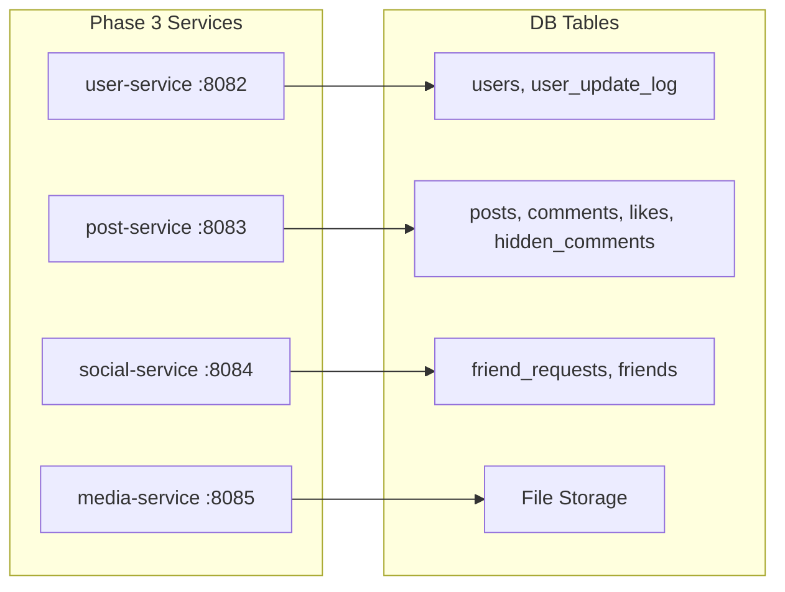

# Phase 3 — Core Business Services

**Estimated Duration:** 7–10 days  
**Dependencies:** Phase 1 (infrastructure) + Phase 2 (auth-service running)  
**Deliverables:** `user-service`, `post-service`, `social-service`, `media-service`

---

## Overview

This is the largest phase — four microservices covering all business domains. Each service follows the same architectural pattern established in Phase 2 and accesses specific tables from the shared `unired_DB` database.



**Build order within this phase:** User → Post → Social → Media (each is independent after auth, but this order allows incremental testing).

---

## 3.1 — User Service

### Purpose
User profile CRUD, search, and account management. Reads/writes to `users` and reads from `user_update_log`.

### Package Structure

```
com.unired.user/
├── UserServiceApplication.kt
├── config/
│   └── SecurityConfig.kt            # Read X-User-Id from headers
├── controller/
│   └── UserController.kt
├── dto/
│   ├── UserProfileResponse.kt
│   ├── UpdateProfileRequest.kt
│   └── UserSearchResult.kt
├── entity/
│   ├── User.kt                      # Same as auth-service entity
│   └── UserUpdateLog.kt
├── repository/
│   ├── UserRepository.kt
│   └── UserUpdateLogRepository.kt
├── service/
│   └── UserService.kt
└── exception/
    └── GlobalExceptionHandler.kt
```

### Endpoints

| Method | Path | Description | Auth | Notes |
|--------|------|-------------|------|-------|
| `GET` | `/users/me` | Current user profile | Authenticated | Uses `X-User-Id` header |
| `GET` | `/users/{id}` | Get user by ID | Authenticated | Public profile view |
| `PUT` | `/users/me` | Update profile | Authenticated | Triggers `trg_user_update_log` |
| `DELETE` | `/users/me` | Soft-delete account | Authenticated | Sets `active = false` |
| `GET` | `/users/search?q={query}` | Search by name | Authenticated | `LIKE '%query%'` with pagination |

### Key Implementation Details

**User context from Gateway:**
```kotlin
// Every controller reads the user ID injected by the API Gateway's JWT filter
@GetMapping("/users/me")
fun getMyProfile(@RequestHeader("X-User-Id") userId: Int): UserProfileResponse
```

**Update profile triggers audit log automatically:**
- The MySQL trigger `trg_user_update_log` fires on `UPDATE users`, writing old/new values to `user_update_log`
- No application code needed for audit — just update the entity and JPA `save()` handles it

**Search query:**
```kotlin
@Query("SELECT u FROM User u WHERE u.fullName LIKE %:query% AND u.active = true")
fun searchByName(@Param("query") query: String, pageable: Pageable): Page<User>
```

**`UserUpdateLog` entity (read-only):**
```kotlin
@Entity
@Table(name = "user_update_log")
@Immutable  // Hibernate hint: this entity is never written by JPA
class UserUpdateLog(
    @Id @Column(name = "log_id") val logId: Int,
    @Column(name = "user_id") val userId: Int,
    @Column(name = "old_full_name") val oldFullName: String?,
    @Column(name = "new_full_name") val newFullName: String?,
    @Column(name = "old_biography") val oldBiography: String?,
    @Column(name = "new_biography") val newBiography: String?,
    @Column(name = "change_date") val changeDate: LocalDateTime
)
```

### Dependencies (build.gradle.kts)

Same pattern as auth-service, **minus** `jjwt` and `spring-security` (JWT is handled by Gateway):

```
spring-boot-starter-web
spring-boot-starter-data-jpa
spring-boot-starter-validation
spring-boot-starter-actuator
spring-cloud-starter-netflix-eureka-client
spring-cloud-starter-config
mysql-connector-j
```

### Verification

```bash
# Get profile (with JWT from Phase 2)
curl -H "Authorization: Bearer <token>" http://localhost:8080/api/users/me

# Update profile
curl -X PUT -H "Authorization: Bearer <token>" \
  -H "Content-Type: application/json" \
  -d '{"fullName":"New Name","biography":"Hello!"}' \
  http://localhost:8080/api/users/me

# Verify audit log was created
mysql -e "SELECT * FROM unired_DB.user_update_log ORDER BY log_id DESC LIMIT 1;"

# Search
curl -H "Authorization: Bearer <token>" "http://localhost:8080/api/users/search?q=Test"
```

---

## 3.2 — Post Service

### Purpose
Posts, comments, likes, and the feed. The most complex service — accesses 4 tables and leverages the `v_posts_stats` view.

### Package Structure

```
com.unired.post/
├── PostServiceApplication.kt
├── controller/
│   ├── PostController.kt
│   ├── CommentController.kt
│   └── LikeController.kt
├── dto/
│   ├── CreatePostRequest.kt          # content: String, image: String?
│   ├── PostResponse.kt               # Full post with stats
│   ├── CreateCommentRequest.kt       # content: String
│   ├── CommentResponse.kt
│   └── LikeResponse.kt
├── entity/
│   ├── Post.kt                       # → posts table
│   ├── Comment.kt                    # → comments table
│   ├── Like.kt                       # → likes table
│   └── HiddenComment.kt             # → hidden_comments table
├── repository/
│   ├── PostRepository.kt
│   ├── CommentRepository.kt
│   ├── LikeRepository.kt
│   └── HiddenCommentRepository.kt
├── service/
│   ├── PostService.kt
│   ├── CommentService.kt
│   └── LikeService.kt
└── exception/
```

### Endpoints — Posts

| Method | Path | Description | Auth |
|--------|------|-------------|------|
| `POST` | `/posts` | Create post | Authenticated |
| `GET` | `/posts/feed` | Paginated feed (newest first) | Authenticated |
| `GET` | `/posts/{id}` | Single post with stats | Authenticated |
| `PUT` | `/posts/{id}` | Edit post content | Owner only |
| `DELETE` | `/posts/{id}` | Soft-delete post | Owner only |
| `GET` | `/posts/user/{userId}` | Posts by user | Authenticated |

### Endpoints — Comments

| Method | Path | Description | Auth |
|--------|------|-------------|------|
| `POST` | `/posts/{id}/comments` | Add comment | Authenticated |
| `GET` | `/posts/{id}/comments` | List comments (paginated) | Authenticated |
| `DELETE` | `/comments/{id}` | Soft-delete comment | Owner only |
| `POST` | `/comments/{id}/hide` | Hide comment for current user | Authenticated |

### Endpoints — Likes

| Method | Path | Description | Auth |
|--------|------|-------------|------|
| `POST` | `/posts/{id}/like` | Like a post | Authenticated |
| `DELETE` | `/posts/{id}/like` | Unlike a post | Authenticated |
| `GET` | `/posts/{id}/likers` | Users who liked | Authenticated |
| `GET` | `/posts/{id}/has-liked` | Check if current user liked | Authenticated |

### Key Implementation Details

**Feed query using `v_posts_stats` view:**
```kotlin
// Option A: Map a read-only entity to the view
@Entity
@Table(name = "v_posts_stats")
@Immutable
class PostStats(
    @Id @Column(name = "post_id") val postId: Int,
    @Column(name = "user_id") val userId: Int,
    val content: String,
    val image: String?,
    @Column(name = "created_at") val createdAt: LocalDateTime,
    @Column(name = "author_name") val authorName: String,
    @Column(name = "author_picture") val authorPicture: String,
    @Column(name = "likes_count") val likesCount: Long,
    @Column(name = "comments_count") val commentsCount: Long
)

// Option B: Native query with pagination
@Query(value = "SELECT * FROM v_posts_stats", nativeQuery = true)
fun getFeed(pageable: Pageable): Page<PostStats>
```

**Like uniqueness:** The `UNIQUE(post_id, user_id)` constraint in MySQL prevents duplicate likes. Handle `DataIntegrityViolationException` gracefully:
```kotlin
fun likePost(postId: Int, userId: Int) {
    try {
        likeRepository.save(Like(postId = postId, userId = userId))
    } catch (e: DataIntegrityViolationException) {
        // Already liked — idempotent, return success
    }
}
```

**Hidden comments filter:** When fetching comments, exclude comments hidden by the requesting user:
```kotlin
@Query("""
    SELECT c FROM Comment c
    WHERE c.postId = :postId AND c.active = true
    AND c.commentId NOT IN (
        SELECT hc.commentId FROM HiddenComment hc WHERE hc.userId = :currentUserId
    )
    ORDER BY c.createdAt ASC
""")
fun findVisibleComments(postId: Int, currentUserId: Int, pageable: Pageable): Page<Comment>
```

**Owner-only enforcement:**
```kotlin
fun deletePost(postId: Int, currentUserId: Int) {
    val post = postRepository.findById(postId).orElseThrow { PostNotFoundException(postId) }
    if (post.userId != currentUserId) throw ForbiddenException("Not the post owner")
    post.active = false
    postRepository.save(post)
}
```

---

## 3.3 — Social Service

### Purpose
Friend requests and friendship management. Accesses `friend_requests` and `friends` tables.

### Package Structure

```
com.unired.social/
├── SocialServiceApplication.kt
├── controller/
│   ├── FriendRequestController.kt
│   └── FriendController.kt
├── dto/
│   ├── FriendRequestResponse.kt
│   ├── SendFriendRequest.kt
│   └── FriendResponse.kt
├── entity/
│   ├── FriendRequest.kt              # → friend_requests table
│   └── Friend.kt                     # → friends table
├── repository/
│   ├── FriendRequestRepository.kt
│   └── FriendRepository.kt
├── service/
│   ├── FriendRequestService.kt
│   └── FriendService.kt
└── exception/
```

### Endpoints — Friend Requests

| Method | Path | Description | Auth |
|--------|------|-------------|------|
| `POST` | `/friends/request/{userId}` | Send friend request | Authenticated |
| `PUT` | `/friends/request/{requestId}/accept` | Accept request | Receiver only |
| `PUT` | `/friends/request/{requestId}/reject` | Reject request | Receiver only |
| `GET` | `/friends/requests/pending` | My pending incoming | Authenticated |
| `GET` | `/friends/requests/sent` | My sent requests | Authenticated |

### Endpoints — Friends

| Method | Path | Description | Auth |
|--------|------|-------------|------|
| `GET` | `/friends` | My friends list | Authenticated |
| `GET` | `/friends/{userId}` | User's friends | Authenticated |
| `DELETE` | `/friends/{friendshipId}` | Remove friend | Either user |
| `GET` | `/friends/check/{userId}` | Check friendship status | Authenticated |

### Key Implementation Details

**Accept request flow:**
```kotlin
fun acceptRequest(requestId: Int, currentUserId: Int) {
    val request = friendRequestRepository.findById(requestId)
        .orElseThrow { RequestNotFoundException(requestId) }

    if (request.receiverId != currentUserId) throw ForbiddenException("Not the receiver")
    if (request.status != "pending") throw BadRequestException("Request already processed")

    // Update request status
    request.status = "accepted"
    request.responseDate = LocalDateTime.now()
    friendRequestRepository.save(request)

    // Create friendship (ensure user_id1 < user_id2 for consistency)
    val (id1, id2) = if (request.senderId < request.receiverId)
        request.senderId to request.receiverId
    else
        request.receiverId to request.senderId

    friendRepository.save(Friend(userId1 = id1, userId2 = id2))
}
```

**Friendship check (bidirectional):**
```kotlin
@Query("""
    SELECT f FROM Friend f
    WHERE (f.userId1 = :userId1 AND f.userId2 = :userId2)
       OR (f.userId1 = :userId2 AND f.userId2 = :userId1)
""")
fun findFriendship(userId1: Int, userId2: Int): Friend?
```

**Prevent duplicate requests:**
```kotlin
@Query("SELECT fr FROM FriendRequest fr WHERE fr.senderId = :senderId AND fr.receiverId = :receiverId AND fr.status = 'pending'")
fun findPendingRequest(senderId: Int, receiverId: Int): FriendRequest?
```

---

## 3.4 — Media Service

### Purpose
Image upload, processing, and serving. Storage-agnostic — starts with local filesystem, can swap to MinIO/S3 later.

### Package Structure

```
com.unired.media/
├── MediaServiceApplication.kt
├── controller/
│   └── MediaController.kt
├── service/
│   ├── MediaService.kt               # Interface
│   └── LocalMediaService.kt          # Filesystem implementation
├── config/
│   └── MediaConfig.kt
└── exception/
```

### Endpoints

| Method | Path | Description | Auth |
|--------|------|-------------|------|
| `POST` | `/media/upload` | Upload image (multipart) | Authenticated |
| `GET` | `/media/{filename}` | Serve image | Public |
| `DELETE` | `/media/{filename}` | Delete image | Owner/Admin |

### Key Implementation Details

**Upload flow:**
```kotlin
@PostMapping("/media/upload")
fun upload(
    @RequestParam("file") file: MultipartFile,
    @RequestHeader("X-User-Id") userId: Int
): ResponseEntity<MediaResponse> {
    // 1. Validate file type (jpeg, png, webp, gif)
    // 2. Generate unique filename: "${userId}_${UUID}_${originalName}"
    // 3. Resize/compress if needed
    // 4. Save to upload directory
    // 5. Return URL path: "/media/${filename}"
}
```

**Storage abstraction:**
```kotlin
interface MediaService {
    fun store(file: MultipartFile, userId: Int): String   // Returns filename
    fun load(filename: String): Resource
    fun delete(filename: String)
}
```

This interface allows swapping `LocalMediaService` for `S3MediaService` later without changing the controller.

**No database access:** Media service doesn't need MySQL — it's pure file I/O. Other services store the returned filename/URL in their own tables (`users.profile_picture`, `posts.image`).

### Dependencies

Same as others, **minus** `spring-data-jpa` and `mysql-connector`:
```
spring-boot-starter-web
spring-boot-starter-validation
spring-boot-starter-actuator
spring-cloud-starter-netflix-eureka-client
spring-cloud-starter-config
```

---

## Shared Patterns Across All Services

### Application Bootstrap Template

Each service's `application.yml`:
```yaml
spring:
  application:
    name: <service-name>
  config:
    import: optional:configserver:http://localhost:8888
```

### User Context Reading

Every controller reads user identity from Gateway-injected headers:
```kotlin
@RequestHeader("X-User-Id") userId: Int
@RequestHeader("X-User-Role", required = false) role: String?
```

### Error Response Format

All services use the same `ErrorResponse` format:
```json
{ "code": "NOT_FOUND", "message": "Post not found: 42" }
```

### Pagination

All list endpoints use Spring Data `Pageable`:
```kotlin
@GetMapping("/posts/feed")
fun getFeed(
    @RequestParam(defaultValue = "0") page: Int,
    @RequestParam(defaultValue = "20") size: Int
): Page<PostResponse>
```

---

## Acceptance Criteria

### User Service
- [ ] `GET /api/users/me` returns current user profile
- [ ] `PUT /api/users/me` updates profile and creates `user_update_log` entry
- [ ] `GET /api/users/search?q=test` returns matching users with pagination
- [ ] `DELETE /api/users/me` soft-deletes (sets `active = false`)

### Post Service
- [ ] `POST /api/posts` creates a post in MySQL
- [ ] `GET /api/posts/feed` returns paginated feed using `v_posts_stats` view
- [ ] `POST /api/posts/{id}/like` creates a like (idempotent)
- [ ] `DELETE /api/posts/{id}/like` removes the like
- [ ] `POST /api/posts/{id}/comments` adds a comment
- [ ] `POST /api/comments/{id}/hide` hides comment from user's view
- [ ] Owner-only enforcement on edit/delete operations

### Social Service
- [ ] `POST /api/friends/request/{userId}` sends friend request
- [ ] `PUT /api/friends/request/{id}/accept` creates friendship + updates request
- [ ] `GET /api/friends` returns user's friends list
- [ ] `GET /api/friends/check/{userId}` returns friendship status
- [ ] Duplicate request prevention works

### Media Service
- [ ] `POST /api/media/upload` stores file and returns URL
- [ ] `GET /api/media/{filename}` serves the image
- [ ] File type validation rejects non-image files
- [ ] All 4 services registered in Eureka dashboard
