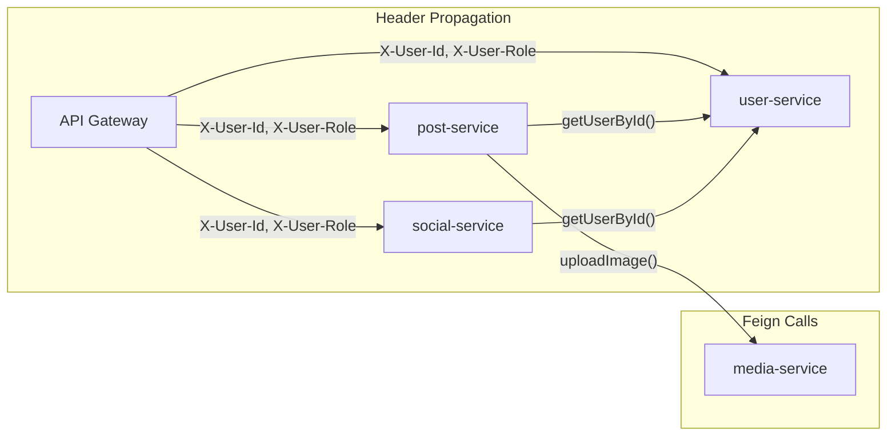

# Phase 4 — Inter-Service Communication

**Estimated Duration:** 2–3 days  
**Dependencies:** Phase 1–3 (all backend services running)  
**Deliverables:** User context propagation, OpenFeign clients, shared `unired-common` library

---

## Overview

With all services running independently, this phase connects them. Services need to call each other (e.g., post-service needs author names from user-service) and share common DTOs and error formats.



---

## Task 4.1 — User Context Propagation

### Current State (from Phase 1)

The API Gateway's `JwtAuthFilter` already:
1. Validates the JWT token
2. Extracts `userId`, `email`, `role` from claims
3. Injects `X-User-Id`, `X-User-Email`, `X-User-Role` headers into downstream requests

### What Each Service Needs

Create a shared utility in each service (or in `unired-common`) to extract user context:

```kotlin
// UserContext.kt — utility to read gateway-injected headers
data class UserContext(
    val userId: Int,
    val email: String,
    val role: String
)

object UserContextHolder {
    fun from(request: HttpServletRequest): UserContext {
        val userId = request.getHeader("X-User-Id")?.toIntOrNull()
            ?: throw UnauthorizedException("Missing X-User-Id header")
        return UserContext(
            userId = userId,
            email = request.getHeader("X-User-Email") ?: "",
            role = request.getHeader("X-User-Role") ?: "user"
        )
    }
}
```

**Alternative — use `@RequestHeader` directly in controllers:**
```kotlin
@GetMapping("/users/me")
fun getProfile(@RequestHeader("X-User-Id") userId: Int): UserProfileResponse
```

### Decision: No per-service JWT validation

Services trust the Gateway. They do NOT validate JWT tokens themselves — they only read `X-User-Id` headers. This avoids:
- Duplicating JWT secret across services
- Redundant token parsing
- Services needing `jjwt` as a dependency

> **Security note:** In production, ensure services are only reachable through the Gateway (not exposed directly). Use network policies or Docker networking to enforce this.

---

## Task 4.2 — Service-to-Service Calls (OpenFeign)

### Why Feign?

When `post-service` returns a post, it needs the author's name and avatar — but it only has `user_id`. Options:
1. **Join at DB level** — post-service queries `users` table directly ❌ (violates service boundaries)
2. **Feign client** — post-service calls user-service's API ✅ (proper microservice communication)
3. **Data duplication** — store author name in `posts` table ❌ (stale data risk)

### Setup

Add to each service that needs cross-service calls:

```kotlin
// build.gradle.kts
dependencies {
    implementation("org.springframework.cloud:spring-cloud-starter-openfeign")
}
```

Enable in the application class:
```kotlin
@SpringBootApplication
@EnableFeignClients
class PostServiceApplication
```

### Feign Client Definitions

#### In `post-service` → calling `user-service`

```kotlin
// client/UserClient.kt
@FeignClient(name = "user-service", fallback = UserClientFallback::class)
interface UserClient {
    @GetMapping("/users/{id}")
    fun getUserById(@PathVariable id: Int): UserSummaryDto
}

// Fallback for resilience
@Component
class UserClientFallback : UserClient {
    override fun getUserById(id: Int) = UserSummaryDto(
        userId = id,
        fullName = "Unknown User",
        profilePicture = "default_avatar.png"
    )
}
```

#### In `social-service` → calling `user-service`

```kotlin
@FeignClient(name = "user-service")
interface UserClient {
    @GetMapping("/users/{id}")
    fun getUserById(@PathVariable id: Int): UserSummaryDto
}
```

### Header Propagation in Feign

When service A calls service B via Feign, the `X-User-*` headers must be forwarded:

```kotlin
// config/FeignConfig.kt
@Configuration
class FeignConfig {
    @Bean
    fun requestInterceptor(): RequestInterceptor {
        return RequestInterceptor { template ->
            val request = (RequestContextHolder.getRequestAttributes() as? ServletRequestAttributes)
                ?.request
            request?.let {
                template.header("X-User-Id", it.getHeader("X-User-Id"))
                template.header("X-User-Email", it.getHeader("X-User-Email"))
                template.header("X-User-Role", it.getHeader("X-User-Role"))
            }
        }
    }
}
```

### Feign Call Matrix

| Caller | Callee | Method | Purpose |
|--------|--------|--------|---------|
| `post-service` | `user-service` | `getUserById(id)` | Enrich post responses with author info |
| `social-service` | `user-service` | `getUserById(id)` | Enrich friend list with profile info |
| `post-service` | `media-service` | `GET /media/{file}` | Validate image exists (optional) |

### Caching Consideration

To avoid excessive Feign calls (e.g., feed with 20 posts = 20 user lookups):

**Option A — Batch endpoint (recommended):**
```kotlin
// In user-service
@PostMapping("/users/batch")
fun getUsersByIds(@RequestBody ids: List<Int>): List<UserSummaryDto>

// In post-service Feign client
@PostMapping("/users/batch")
fun getUsersByIds(@RequestBody ids: List<Int>): List<UserSummaryDto>
```

**Option B — Use the `v_posts_stats` view:**
The feed already uses `v_posts_stats` which joins `users` data at the DB level. Only individual post detail screens need Feign enrichment.

### Resilience

Add circuit breaker configuration for Feign clients:

```yaml
# In application.yml (shared config)
spring:
  cloud:
    openfeign:
      circuitbreaker:
        enabled: true

resilience4j:
  circuitbreaker:
    instances:
      user-service:
        sliding-window-size: 10
        failure-rate-threshold: 50
        wait-duration-in-open-state: 10s
```

---

## Task 4.3 — Shared Library (`unired-common`)

### Purpose

A lightweight shared Kotlin library published to the local Maven repository, containing:
- Common DTOs shared across services
- Standard error response format
- Pagination wrapper
- Utility constants

### Project Structure

```
unired-common/
├── build.gradle.kts
├── settings.gradle.kts
└── src/main/kotlin/com/unired/common/
    ├── dto/
    │   ├── UserSummaryDto.kt
    │   ├── PaginatedResponse.kt
    │   └── ErrorResponse.kt
    ├── exception/
    │   ├── NotFoundException.kt
    │   ├── ForbiddenException.kt
    │   ├── UnauthorizedException.kt
    │   └── BadRequestException.kt
    └── constants/
        └── Headers.kt
```

### Key DTOs

```kotlin
// dto/UserSummaryDto.kt — lightweight user info for cross-service responses
data class UserSummaryDto(
    val userId: Int,
    val fullName: String,
    val profilePicture: String = "default_avatar.png"
)

// dto/PaginatedResponse.kt — standard paginated wrapper
data class PaginatedResponse<T>(
    val content: List<T>,
    val page: Int,
    val size: Int,
    val totalElements: Long,
    val totalPages: Int,
    val isLast: Boolean
)

// dto/ErrorResponse.kt — RFC 7807-inspired error format
data class ErrorResponse(
    val code: String,
    val message: String?,
    val timestamp: LocalDateTime = LocalDateTime.now(),
    val path: String? = null
)
```

### Constants

```kotlin
// constants/Headers.kt
object Headers {
    const val USER_ID = "X-User-Id"
    const val USER_EMAIL = "X-User-Email"
    const val USER_ROLE = "X-User-Role"
}
```

### Publishing to Local Maven

```kotlin
// build.gradle.kts
plugins {
    kotlin("jvm") version "2.2.21"
    `maven-publish`
}

group = "com.unired"
version = "0.0.1-SNAPSHOT"

publishing {
    publications {
        create<MavenPublication>("maven") {
            from(components["kotlin"])
        }
    }
}
```

```bash
cd unired-common
./gradlew publishToMavenLocal
```

### Consuming in Services

Each service adds to its `build.gradle.kts`:
```kotlin
repositories {
    mavenCentral()
    mavenLocal()  // Add this
}

dependencies {
    implementation("com.unired:unired-common:0.0.1-SNAPSHOT")
}
```

---

## Verification Plan

### Feign Client Tests

```bash
# 1. Create a post (already works from Phase 3)
POST /api/posts → creates post with user_id

# 2. Get post detail — should include author info from user-service
GET /api/posts/{id}
# Expected response includes: authorName, authorPicture (fetched via Feign)

# 3. Get friend list — should include friend profile info
GET /api/friends
# Expected: each friend entry has fullName, profilePicture

# 4. Test Feign fallback — stop user-service, then request a post
# Expected: author shows "Unknown User" instead of 500 error
```

### Header Propagation Test

```bash
# Start all services, make a request that triggers Feign
curl -H "Authorization: Bearer <token>" http://localhost:8080/api/posts/1

# In user-service logs, verify X-User-Id header is received in the Feign call
```

---

## Acceptance Criteria

- [ ] `X-User-Id`, `X-User-Email`, `X-User-Role` headers propagate from Gateway to all services
- [ ] Post detail responses include author name/picture from user-service (Feign)
- [ ] Friend list responses include profile info from user-service (Feign)
- [ ] Feign fallback returns graceful defaults when target service is down
- [ ] `unired-common` is published to local Maven and consumed by all services
- [ ] All services use `ErrorResponse` from `unired-common` for consistent error format
- [ ] Circuit breaker prevents cascading failures

---

## Files Created/Modified Summary

| Action | Path | Purpose |
|--------|------|---------|
| **[NEW]** | `unired-common/` | Shared library (DTOs, exceptions, constants) |
| **[MODIFY]** | `post-service/build.gradle.kts` | Add `openfeign` + `unired-common` deps |
| **[NEW]** | `post-service/.../client/UserClient.kt` | Feign client for user-service |
| **[NEW]** | `post-service/.../config/FeignConfig.kt` | Header propagation interceptor |
| **[MODIFY]** | `social-service/build.gradle.kts` | Add `openfeign` + `unired-common` deps |
| **[NEW]** | `social-service/.../client/UserClient.kt` | Feign client for user-service |
| **[MODIFY]** | `user-service/.../controller/` | Add `/users/batch` endpoint |
| **[MODIFY]** | All services | Replace local DTOs with `unired-common` imports |
