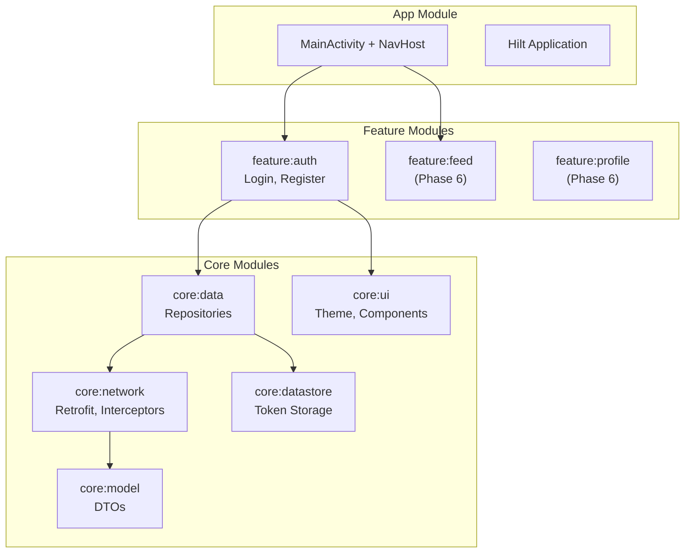

# Phase 5 — Android App Foundation

**Estimated Duration:** 5–7 days  
**Dependencies:** Phase 1–3 (backend running: at minimum auth-service + API Gateway)  
**Deliverables:** Android project with multi-module structure, Retrofit networking, Hilt DI, navigation graph, and complete auth flow

---

## Overview

This phase sets up the Android application foundation — the "skeleton" that all feature screens will plug into. By the end of this phase, you'll have a working app that can register, login, persist tokens, and navigate between auth and main screens.



---

## Task 5.1 — Project Setup

### 5.1.1 — Create with Android Studio

Use the **Empty Compose Activity** template with:
- **Project name:** UniRed
- **Package name:** `com.unired.android`
- **Min SDK:** API 26 (Android 8.0) — covers ~95% of devices
- **Build configuration language:** Kotlin DSL
- **Project directory:** `unired-android/` within the repo root

### 5.1.2 — Multi-Module Gradle Structure

```
unired-android/
├── app/                              # Application entry point
│   ├── build.gradle.kts
│   └── src/main/
│       ├── kotlin/com/unired/android/
│       │   ├── UniRedApp.kt          # @HiltAndroidApp
│       │   ├── MainActivity.kt       # Single Activity
│       │   └── navigation/
│       │       └── NavGraph.kt       # Root NavHost
│       └── res/
├── core/
│   ├── network/                      # Retrofit, API interfaces, interceptors
│   │   ├── build.gradle.kts
│   │   └── src/main/kotlin/com/unired/android/core/network/
│   │       ├── di/NetworkModule.kt
│   │       ├── api/AuthApi.kt
│   │       ├── interceptor/AuthInterceptor.kt
│   │       └── interceptor/TokenAuthenticator.kt
│   ├── model/                        # Shared data classes / DTOs
│   │   ├── build.gradle.kts
│   │   └── src/main/kotlin/com/unired/android/core/model/
│   │       ├── User.kt
│   │       ├── AuthTokens.kt
│   │       └── ApiError.kt
│   ├── data/                         # Repository implementations
│   │   ├── build.gradle.kts
│   │   └── src/main/kotlin/com/unired/android/core/data/
│   │       └── repository/AuthRepository.kt
│   ├── datastore/                    # DataStore preferences (token storage)
│   │   ├── build.gradle.kts
│   │   └── src/main/kotlin/com/unired/android/core/datastore/
│   │       └── TokenManager.kt
│   └── ui/                           # Shared composables, theme
│       ├── build.gradle.kts
│       └── src/main/kotlin/com/unired/android/core/ui/
│           ├── theme/Theme.kt
│           ├── theme/Color.kt
│           ├── theme/Type.kt
│           └── component/
│               ├── UniRedButton.kt
│               ├── UniRedTextField.kt
│               └── LoadingIndicator.kt
└── feature/
    ├── auth/                         # Login & Register
    │   ├── build.gradle.kts
    │   └── src/main/kotlin/com/unired/android/feature/auth/
    │       ├── LoginScreen.kt
    │       ├── LoginViewModel.kt
    │       ├── RegisterScreen.kt
    │       └── RegisterViewModel.kt
    ├── feed/                         # (Phase 6)
    ├── post/                         # (Phase 6)
    ├── profile/                      # (Phase 6)
    └── social/                       # (Phase 6)
```

### 5.1.3 — Root `settings.gradle.kts`

```kotlin
include(":app")
include(":core:network")
include(":core:model")
include(":core:data")
include(":core:datastore")
include(":core:ui")
include(":feature:auth")
include(":feature:feed")
include(":feature:post")
include(":feature:profile")
include(":feature:social")
```

### 5.1.4 — Version Catalog (`gradle/libs.versions.toml`)

Centralize all dependency versions:

```toml
[versions]
kotlin = "2.1.20"
compose-bom = "2025.04.01"
hilt = "2.56.2"
retrofit = "2.11.0"
okhttp = "4.12.0"
coil = "3.2.0"
navigation = "2.9.0"
datastore = "1.1.7"
room = "2.7.1"
kotlinx-serialization = "1.8.1"

[libraries]
# Compose
compose-bom = { module = "androidx.compose:compose-bom", version.ref = "compose-bom" }
compose-material3 = { module = "androidx.compose.material3:material3" }
compose-ui-tooling = { module = "androidx.compose.ui:ui-tooling" }

# Hilt
hilt-android = { module = "com.google.dagger:hilt-android", version.ref = "hilt" }
hilt-compiler = { module = "com.google.dagger:hilt-compiler", version.ref = "hilt" }
hilt-navigation-compose = { module = "androidx.hilt:hilt-navigation-compose", version = "1.2.0" }

# Networking
retrofit = { module = "com.squareup.retrofit2:retrofit", version.ref = "retrofit" }
retrofit-kotlinx = { module = "com.squareup.retrofit2:converter-kotlinx-serialization", version.ref = "retrofit" }
okhttp = { module = "com.squareup.okhttp3:okhttp", version.ref = "okhttp" }
okhttp-logging = { module = "com.squareup.okhttp3:logging-interceptor", version.ref = "okhttp" }

# Navigation
navigation-compose = { module = "androidx.navigation:navigation-compose", version.ref = "navigation" }

# Coil
coil-compose = { module = "io.coil-kt.coil3:coil-compose", version.ref = "coil" }
coil-network = { module = "io.coil-kt.coil3:coil-network-okhttp", version.ref = "coil" }

# DataStore
datastore-preferences = { module = "androidx.datastore:datastore-preferences", version.ref = "datastore" }

# Serialization
kotlinx-serialization = { module = "org.jetbrains.kotlinx:kotlinx-serialization-json", version.ref = "kotlinx-serialization" }
```

---

## Task 5.2 — Core Network Layer

### 5.2.1 — Hilt Network Module

```kotlin
// core/network/di/NetworkModule.kt
@Module
@InstallIn(SingletonComponent::class)
object NetworkModule {

    @Provides @Singleton
    fun provideOkHttpClient(
        authInterceptor: AuthInterceptor,
        tokenAuthenticator: TokenAuthenticator
    ): OkHttpClient {
        return OkHttpClient.Builder()
            .addInterceptor(authInterceptor)
            .addInterceptor(HttpLoggingInterceptor().apply {
                level = HttpLoggingInterceptor.Level.BODY
            })
            .authenticator(tokenAuthenticator)  // Auto-refresh on 401
            .connectTimeout(30, TimeUnit.SECONDS)
            .readTimeout(30, TimeUnit.SECONDS)
            .build()
    }

    @Provides @Singleton
    fun provideRetrofit(okHttpClient: OkHttpClient): Retrofit {
        return Retrofit.Builder()
            .baseUrl(BuildConfig.API_BASE_URL)  // "http://10.0.2.2:8080/api/"
            .client(okHttpClient)
            .addConverterFactory(Json.asConverterFactory("application/json".toMediaType()))
            .build()
    }
}
```

> **Note:** `10.0.2.2` is the Android emulator's alias for `localhost`. For physical devices, use the machine's LAN IP.

### 5.2.2 — Auth Interceptor

Automatically attaches the JWT access token to every request:

```kotlin
// core/network/interceptor/AuthInterceptor.kt
@Singleton
class AuthInterceptor @Inject constructor(
    private val tokenManager: TokenManager
) : Interceptor {
    override fun intercept(chain: Interceptor.Chain): Response {
        val token = runBlocking { tokenManager.getAccessToken() }
        val request = if (token != null) {
            chain.request().newBuilder()
                .addHeader("Authorization", "Bearer $token")
                .build()
        } else {
            chain.request()
        }
        return chain.proceed(request)
    }
}
```

### 5.2.3 — Token Authenticator (Auto-Refresh)

When a request returns 401, automatically refresh the token and retry:

```kotlin
// core/network/interceptor/TokenAuthenticator.kt
@Singleton
class TokenAuthenticator @Inject constructor(
    private val tokenManager: TokenManager,
    @ApplicationContext private val context: Context
) : Authenticator {
    override fun authenticate(route: Route?, response: Response): Request? {
        if (response.code == 401) {
            val refreshToken = runBlocking { tokenManager.getRefreshToken() } ?: return null

            // Call refresh endpoint
            val newTokens = runBlocking { refreshTokens(refreshToken) } ?: run {
                // Refresh failed — clear tokens, navigate to login
                runBlocking { tokenManager.clearTokens() }
                return null
            }

            // Save new tokens
            runBlocking { tokenManager.saveTokens(newTokens) }

            // Retry the original request with new access token
            return response.request.newBuilder()
                .header("Authorization", "Bearer ${newTokens.accessToken}")
                .build()
        }
        return null
    }
}
```

### 5.2.4 — API Interfaces

```kotlin
// core/network/api/AuthApi.kt
interface AuthApi {
    @POST("auth/register")
    suspend fun register(@Body request: RegisterRequest): AuthResponse

    @POST("auth/login")
    suspend fun login(@Body request: LoginRequest): AuthResponse

    @POST("auth/refresh")
    suspend fun refreshToken(@Body request: TokenRefreshRequest): AuthResponse
}
```

Provide via Hilt:
```kotlin
@Provides @Singleton
fun provideAuthApi(retrofit: Retrofit): AuthApi = retrofit.create(AuthApi::class.java)
```

---

## Task 5.3 — Token Storage (DataStore)

```kotlin
// core/datastore/TokenManager.kt
@Singleton
class TokenManager @Inject constructor(
    @ApplicationContext private val context: Context
) {
    private val dataStore = context.createDataStore(name = "auth_prefs")

    companion object {
        val ACCESS_TOKEN = stringPreferencesKey("access_token")
        val REFRESH_TOKEN = stringPreferencesKey("refresh_token")
        val USER_ID = intPreferencesKey("user_id")
    }

    suspend fun saveTokens(response: AuthResponse) {
        dataStore.edit { prefs ->
            prefs[ACCESS_TOKEN] = response.accessToken
            prefs[REFRESH_TOKEN] = response.refreshToken
            prefs[USER_ID] = response.userId
        }
    }

    suspend fun getAccessToken(): String? = dataStore.data.first()[ACCESS_TOKEN]
    suspend fun getRefreshToken(): String? = dataStore.data.first()[REFRESH_TOKEN]
    suspend fun isLoggedIn(): Boolean = getAccessToken() != null

    suspend fun clearTokens() {
        dataStore.edit { it.clear() }
    }
}
```

---

## Task 5.4 — Navigation Graph

### 5.4.1 — Type-Safe Routes

```kotlin
// app/navigation/Routes.kt
@Serializable object Login
@Serializable object Register
@Serializable object Feed
@Serializable data class PostDetail(val postId: Int)
@Serializable data class UserProfile(val userId: Int)
@Serializable object Friends
@Serializable object FriendRequests
@Serializable object CreatePost
@Serializable object EditProfile
@Serializable object Search
```

### 5.4.2 — NavHost Setup

```kotlin
// app/navigation/NavGraph.kt
@Composable
fun UniRedNavHost(
    navController: NavHostController,
    isLoggedIn: Boolean
) {
    NavHost(
        navController = navController,
        startDestination = if (isLoggedIn) Feed else Login
    ) {
        composable<Login> {
            LoginScreen(
                onLoginSuccess = { navController.navigate(Feed) { popUpTo(Login) { inclusive = true } } },
                onNavigateToRegister = { navController.navigate(Register) }
            )
        }
        composable<Register> {
            RegisterScreen(
                onRegisterSuccess = { navController.navigate(Feed) { popUpTo(Login) { inclusive = true } } },
                onNavigateToLogin = { navController.popBackStack() }
            )
        }
        composable<Feed> { FeedScreen(navController) }
        composable<PostDetail> { PostDetailScreen(navController) }
        composable<UserProfile> { ProfileScreen(navController) }
        composable<Friends> { FriendsScreen(navController) }
        composable<CreatePost> { CreatePostScreen(navController) }
        // ... more routes
    }
}
```

### 5.4.3 — Auth Flow

```
App Launch
    │
    ├── TokenManager.isLoggedIn()?
    │   ├── true  → startDestination = Feed
    │   └── false → startDestination = Login
    │
    ├── On any 401 (TokenAuthenticator refresh fails)
    │   └── Clear tokens → Navigate to Login
    │
    └── Logout button
        └── Clear tokens → Navigate to Login
```

---

## Task 5.5 — Design System (core:ui)

### Theme

```kotlin
// core/ui/theme/Color.kt
val UniRedPrimary = Color(0xFF6C63FF)     // Purple accent
val UniRedSecondary = Color(0xFF03DAC5)    // Teal
val UniRedBackground = Color(0xFF121212)   // Dark background
val UniRedSurface = Color(0xFF1E1E1E)     // Card surface
val UniRedError = Color(0xFFCF6679)

// core/ui/theme/Theme.kt
@Composable
fun UniRedTheme(
    darkTheme: Boolean = isSystemInDarkTheme(),
    content: @Composable () -> Unit
) {
    val colorScheme = if (darkTheme) darkColorScheme(
        primary = UniRedPrimary,
        secondary = UniRedSecondary,
        background = UniRedBackground,
        surface = UniRedSurface,
        error = UniRedError
    ) else lightColorScheme(/* ... */)

    MaterialTheme(
        colorScheme = colorScheme,
        typography = UniRedTypography,
        content = content
    )
}
```

### Reusable Components

- `UniRedButton` — Primary/secondary variants with loading state
- `UniRedTextField` — Outlined text field with error display
- `UniRedTopBar` — App bar with back navigation
- `LoadingIndicator` — Centered circular progress
- `ErrorMessage` — Error state with retry button
- `UserAvatar` — Circular image with Coil loading + placeholder

---

## Task 5.6 — Auth Repository

```kotlin
// core/data/repository/AuthRepository.kt
@Singleton
class AuthRepository @Inject constructor(
    private val authApi: AuthApi,
    private val tokenManager: TokenManager
) {
    suspend fun login(email: String, password: String): Result<AuthResponse> {
        return try {
            val response = authApi.login(LoginRequest(email, password))
            tokenManager.saveTokens(response)
            Result.success(response)
        } catch (e: Exception) {
            Result.failure(e)
        }
    }

    suspend fun register(fullName: String, email: String, password: String): Result<AuthResponse> {
        return try {
            val response = authApi.register(RegisterRequest(fullName, email, password))
            tokenManager.saveTokens(response)
            Result.success(response)
        } catch (e: Exception) {
            Result.failure(e)
        }
    }

    suspend fun logout() { tokenManager.clearTokens() }
    suspend fun isLoggedIn(): Boolean = tokenManager.isLoggedIn()
}
```

---

## Verification Plan

| Test | How to verify |
|------|---------------|
| App compiles | `./gradlew assembleDebug` succeeds |
| Hilt injection | App starts without DI crash |
| Login flow | Enter credentials → API call → token saved → navigates to Feed |
| Register flow | Fill form → API call → token saved → navigates to Feed |
| Token persistence | Kill app → reopen → goes straight to Feed (not Login) |
| Logout | Tap logout → tokens cleared → redirected to Login |
| Token refresh | Wait 15 min (or manually expire) → next request auto-refreshes |
| Invalid credentials | Wrong password → error message displayed, no crash |

---

## Acceptance Criteria

- [ ] Multi-module Gradle project builds without errors
- [ ] Hilt DI correctly provides Retrofit, OkHttp, TokenManager
- [ ] `LoginScreen` sends POST to `/api/auth/login` and receives JWT
- [ ] `RegisterScreen` sends POST to `/api/auth/register` and receives JWT
- [ ] Tokens persist in DataStore, app resumes logged-in state after restart
- [ ] `AuthInterceptor` attaches `Authorization: Bearer` header to all requests
- [ ] `TokenAuthenticator` auto-refreshes on 401
- [ ] Navigation graph correctly routes between Login ↔ Register ↔ Feed
- [ ] Design system (theme, colors, typography) is applied consistently
- [ ] Shared composable components render correctly
