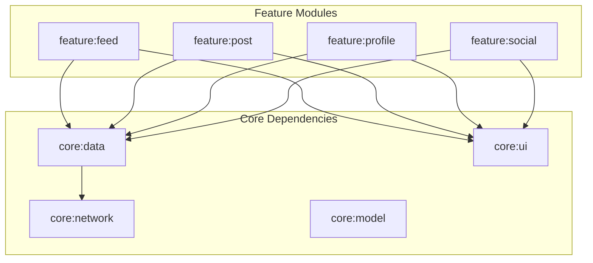

# Phase 6 — Android Feature Screens

**Estimated Duration:** 10–14 days  
**Dependencies:** Phase 5 (Android foundation + auth flow working)  
**Deliverables:** Feed, Post Detail, Profile, Social, and Create Post screens

---

## Overview

This phase builds all user-facing feature screens. Each feature lives in its own module under `feature/` and follows the MVVM pattern: `Screen (Compose) → ViewModel → Repository → API`.



**Build order:** Feed → Post Detail → Profile → Social → Create Post

---

## 6.1 — Feed Screen (Home)

### API Interface

```kotlin
// core/network/api/PostApi.kt
interface PostApi {
    @GET("posts/feed")
    suspend fun getFeed(
        @Query("page") page: Int = 0,
        @Query("size") size: Int = 20
    ): PaginatedResponse<PostResponse>

    @POST("posts/{id}/like")
    suspend fun likePost(@Path("id") postId: Int)

    @DELETE("posts/{id}/like")
    suspend fun unlikePost(@Path("id") postId: Int)

    @GET("posts/{id}/has-liked")
    suspend fun hasLiked(@Path("id") postId: Int): HasLikedResponse
}
```

### ViewModel

```kotlin
// feature/feed/FeedViewModel.kt
@HiltViewModel
class FeedViewModel @Inject constructor(
    private val postRepository: PostRepository
) : ViewModel() {

    private val _uiState = MutableStateFlow<FeedUiState>(FeedUiState.Loading)
    val uiState: StateFlow<FeedUiState> = _uiState.asStateFlow()

    private var currentPage = 0
    private var isLastPage = false

    init { loadFeed() }

    fun loadFeed() { /* fetch page 0, set state */ }
    fun loadMore() { /* fetch next page, append to list */ }
    fun refresh() { /* reset page 0, reload */ }
    fun toggleLike(postId: Int) { /* optimistic update + API call */ }
}

sealed interface FeedUiState {
    object Loading : FeedUiState
    data class Success(
        val posts: List<PostUiModel>,
        val isLoadingMore: Boolean = false,
        val isRefreshing: Boolean = false
    ) : FeedUiState
    data class Error(val message: String) : FeedUiState
}
```

### Screen Composable

```kotlin
// feature/feed/FeedScreen.kt
@Composable
fun FeedScreen(navController: NavController, viewModel: FeedViewModel = hiltViewModel()) {
    val uiState by viewModel.uiState.collectAsStateWithLifecycle()

    Scaffold(
        topBar = { UniRedTopBar(title = "UniRed") },
        floatingActionButton = {
            FloatingActionButton(onClick = { navController.navigate(CreatePost) }) {
                Icon(Icons.Default.Add, "Create Post")
            }
        }
    ) { padding ->
        when (val state = uiState) {
            is FeedUiState.Loading -> LoadingIndicator()
            is FeedUiState.Error -> ErrorMessage(state.message, onRetry = viewModel::refresh)
            is FeedUiState.Success -> {
                PullToRefreshBox(
                    isRefreshing = state.isRefreshing,
                    onRefresh = viewModel::refresh
                ) {
                    LazyColumn(modifier = Modifier.padding(padding)) {
                        items(state.posts, key = { it.postId }) { post ->
                            PostCard(
                                post = post,
                                onLikeClick = { viewModel.toggleLike(post.postId) },
                                onPostClick = { navController.navigate(PostDetail(post.postId)) },
                                onAuthorClick = { navController.navigate(UserProfile(post.userId)) }
                            )
                        }
                        // Infinite scroll trigger
                        item {
                            if (!state.isLoadingMore) {
                                LaunchedEffect(Unit) { viewModel.loadMore() }
                            } else {
                                CircularProgressIndicator(Modifier.padding(16.dp))
                            }
                        }
                    }
                }
            }
        }
    }
}
```

### PostCard Component

Each card shows:
- Author avatar (circular, loaded with Coil) + author name → tappable, navigates to profile
- Timestamp (relative: "2h ago", "Yesterday")
- Post content text
- Optional image (loaded with Coil, aspect-ratio preserved)
- Like button (heart icon, filled when liked) + like count
- Comment icon + comment count
- Entire card tappable → navigates to PostDetail

---

## 6.2 — Post Detail Screen

### API Interface

```kotlin
// Additional endpoints in PostApi
@GET("posts/{id}")
suspend fun getPost(@Path("id") postId: Int): PostResponse

@GET("posts/{id}/comments")
suspend fun getComments(
    @Path("id") postId: Int,
    @Query("page") page: Int = 0
): PaginatedResponse<CommentResponse>

@POST("posts/{id}/comments")
suspend fun addComment(@Path("id") postId: Int, @Body request: CreateCommentRequest)

@DELETE("comments/{id}")
suspend fun deleteComment(@Path("id") commentId: Int)

@POST("comments/{id}/hide")
suspend fun hideComment(@Path("id") commentId: Int)
```

### Screen Layout

```
┌─────────────────────────────────┐
│ ← Post                         │  ← TopBar with back nav
├─────────────────────────────────┤
│ [Avatar] Author Name            │
│          2 hours ago            │
│                                 │
│ Post content text goes here...  │
│                                 │
│ [  Post Image (if present)   ]  │
│                                 │
│ ♥ 24 likes    💬 8 comments     │  ← Like toggle + counts
├─────────────────────────────────┤
│ Comments:                       │
│ ┌─────────────────────────────┐ │
│ │ [Av] User1: Great post!    │ │  ← Swipe to hide/delete
│ │ [Av] User2: Love it 🔥     │ │
│ │ ...                        │ │
│ └─────────────────────────────┘ │
├─────────────────────────────────┤
│ [Write a comment...    ] [Send] │  ← Input bar (sticky bottom)
└─────────────────────────────────┘
```

### Key Features

- **Owner actions:** If current user is the post author, show edit/delete menu (three dots icon)
- **Comment context menu:** Long-press a comment to show options:
  - Own comment → "Delete"
  - Other's comment → "Hide"
- **Optimistic like toggle:** Update UI immediately, revert on API failure
- **Comment input:** Sticky bottom bar, auto-focus, submit with keyboard action

---

## 6.3 — Profile Screen

### API Interface

```kotlin
// core/network/api/UserApi.kt
interface UserApi {
    @GET("users/me")
    suspend fun getMyProfile(): UserProfileResponse

    @GET("users/{id}")
    suspend fun getUserById(@Path("id") userId: Int): UserProfileResponse

    @PUT("users/me")
    suspend fun updateProfile(@Body request: UpdateProfileRequest): UserProfileResponse

    @GET("users/search")
    suspend fun searchUsers(@Query("q") query: String): PaginatedResponse<UserSearchResult>
}
```

### Screen Layout

```
┌─────────────────────────────────┐
│ ← Profile          [Edit/Add]   │  ← Edit (own) or Add Friend (other)
├─────────────────────────────────┤
│                                 │
│        [  Avatar (large)  ]     │
│        Full Name                │
│        user@email.com           │
│        "Biography text..."      │
│                                 │
│  ┌──────────┐  ┌──────────┐    │
│  │ 42 Posts  │  │ 15 Friends│    │  ← Stats row
│  └──────────┘  └──────────┘    │
├─────────────────────────────────┤
│ Posts    (tab)                   │
├─────────────────────────────────┤
│ [User's posts list...]          │
└─────────────────────────────────┘
```

### Own Profile vs. Other User

| Feature | Own Profile | Other User |
|---------|------------|------------|
| Top bar action | "Edit" button | "Add Friend" / "Friends ✓" |
| Avatar | Tappable to change | View only |
| Bio | Editable (edit screen) | View only |
| Posts tab | Shows own posts | Shows their posts |

### Edit Profile Screen

- Pre-filled form with current name, bio
- Avatar picker: tap avatar → bottom sheet with Camera / Gallery options
- Upload new avatar via media-service, save URL via user-service `PUT /users/me`
- Save button → API call → navigate back with updated data

---

## 6.4 — Social Screens

### 6.4.1 — Friends List

```kotlin
// core/network/api/SocialApi.kt
interface SocialApi {
    @GET("friends")
    suspend fun getMyFriends(): List<FriendResponse>

    @GET("friends/{userId}")
    suspend fun getUserFriends(@Path("userId") userId: Int): List<FriendResponse>

    @DELETE("friends/{friendshipId}")
    suspend fun removeFriend(@Path("friendshipId") friendshipId: Int)

    @GET("friends/check/{userId}")
    suspend fun checkFriendship(@Path("userId") userId: Int): FriendshipStatusResponse

    @POST("friends/request/{userId}")
    suspend fun sendFriendRequest(@Path("userId") userId: Int)

    @GET("friends/requests/pending")
    suspend fun getPendingRequests(): List<FriendRequestResponse>

    @GET("friends/requests/sent")
    suspend fun getSentRequests(): List<FriendRequestResponse>

    @PUT("friends/request/{requestId}/accept")
    suspend fun acceptRequest(@Path("requestId") requestId: Int)

    @PUT("friends/request/{requestId}/reject")
    suspend fun rejectRequest(@Path("requestId") requestId: Int)
}
```

### Friends List Layout

Grid or list of friends, each showing:
- Avatar + name
- Tap → navigates to profile
- Long press / swipe → "Remove Friend" confirmation dialog

### 6.4.2 — Friend Requests Screen

Two tabs:
- **Incoming:** Pending requests with Accept / Reject buttons
- **Sent:** Sent requests with "Pending" status badge

### 6.4.3 — Search Screen

- Search bar at top with debounced input (300ms)
- Results list: avatar + name + "Add Friend" / "Friends ✓" / "Pending..." button
- Empty state: "Search for users by name"

---

## 6.5 — Create/Edit Post Screen

### Layout

```
┌─────────────────────────────────┐
│ ← Create Post         [Post]   │  ← Post button (disabled until content)
├─────────────────────────────────┤
│ [Avatar] Your Name              │
│                                 │
│ ┌─────────────────────────────┐ │
│ │ What's on your mind?        │ │  ← Multi-line text input
│ │                             │ │
│ │                             │ │
│ └─────────────────────────────┘ │
│                                 │
│ [  Selected Image Preview    ]  │  ← Shows after image selection
│         [✕ Remove]              │
│                                 │
├─────────────────────────────────┤
│ [📷 Photo] [🖼 Gallery]         │  ← Image picker buttons
└─────────────────────────────────┘
```

### Flow

1. User writes text content (required, non-empty)
2. Optionally selects image from gallery or camera
3. Taps "Post" button
4. If image selected: upload to media-service first → get URL
5. Create post with content + image URL → post-service
6. Show loading overlay during upload
7. On success: navigate back to Feed (new post appears at top)

---

## Bottom Navigation

The main app shell uses a `BottomNavigation` bar with:

| Icon | Label | Route | Badge |
|------|-------|-------|-------|
| 🏠 | Feed | `Feed` | — |
| 🔍 | Search | `Search` | — |
| ➕ | Post | `CreatePost` | — |
| 👥 | Friends | `Friends` | Pending count |
| 👤 | Profile | `UserProfile(myId)` | — |

```kotlin
// app/navigation/BottomNavBar.kt
@Composable
fun UniRedBottomBar(navController: NavController, pendingCount: Int) {
    NavigationBar {
        NavigationBarItem(
            icon = { Icon(Icons.Default.Home, "Feed") },
            label = { Text("Feed") },
            selected = currentRoute == "Feed",
            onClick = { navController.navigate(Feed) }
        )
        // ... Search, CreatePost, Friends (with badge), Profile
    }
}
```

---

## Verification Plan

| Screen | Test | Expected |
|--------|------|----------|
| Feed | Launch app logged in | Posts load with author info, images, counts |
| Feed | Scroll to bottom | Next page loads automatically |
| Feed | Pull down | Refreshes feed from page 0 |
| Feed | Tap heart icon | Like count updates, icon fills |
| Post Detail | Tap a post card | Detail screen with comments loads |
| Post Detail | Type comment + send | Comment appears in list |
| Profile (own) | Tap profile tab | Shows name, bio, avatar, post count |
| Profile (own) | Tap edit | Edit form pre-filled, can save changes |
| Profile (other) | Tap author name on post | Shows their profile with "Add Friend" |
| Friends | Open friends tab | List of current friends loads |
| Friend Requests | Open pending tab | Incoming requests with accept/reject |
| Search | Type a name | Results appear with friend status |
| Create Post | Write text + select image | Post created, appears in feed |

---

## Acceptance Criteria

- [ ] Feed screen loads paginated posts from `/api/posts/feed`
- [ ] Pull-to-refresh and infinite scroll pagination work
- [ ] Like/unlike toggles with optimistic UI update
- [ ] Post detail shows full content, image, comments
- [ ] Comments can be added, deleted (own), and hidden (others')
- [ ] Own profile shows editable fields; other profiles show "Add Friend"
- [ ] Profile picture can be changed via camera/gallery picker
- [ ] Friends list displays with avatars; can remove friends
- [ ] Friend requests screen shows incoming + sent with actions
- [ ] Search finds users by name with debounced input
- [ ] Create post with text and optional image uploads successfully
- [ ] Bottom navigation works with correct route highlighting
- [ ] All screens handle loading, error, and empty states gracefully
