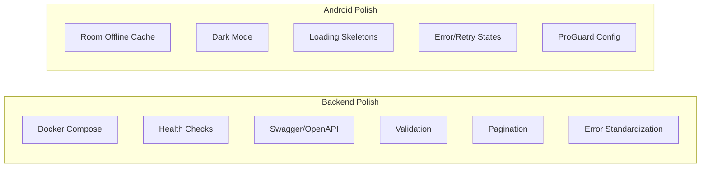

# Phase 7 — Polish & Deployment

**Estimated Duration:** 3–5 days  
**Dependencies:** Phase 1–6 (full stack functional)  
**Deliverables:** Docker Compose deployment, API docs, offline caching, dark mode, error handling, testing

---

## Overview

This final phase hardens the application for production readiness. It covers containerization, API documentation, request validation, offline support, and UI polish.



---

## 7.1 — Backend Polish

### 7.1.1 — Dockerize Each Service

Each service gets a `Dockerfile`:

```dockerfile
# Standard Dockerfile for all Spring Boot services
FROM eclipse-temurin:17-jre-alpine
WORKDIR /app
COPY build/libs/*.jar app.jar
EXPOSE 808X
ENTRYPOINT ["java", "-jar", "app.jar"]
```

**Build workflow:**
```bash
# For each service:
cd <service-dir>
./gradlew bootJar
docker build -t unired/<service-name>:latest .
```

### 7.1.2 — Docker Compose

Full-stack `docker-compose.yml` at project root:

```yaml
services:
  mysql:
    image: mysql:8
    environment:
      MYSQL_ROOT_PASSWORD: ${MYSQL_PASSWORD:-root}
      MYSQL_DATABASE: unired_DB
    volumes:
      - ./unired-db.sql:/docker-entrypoint-initdb.d/init.sql
      - mysql-data:/var/lib/mysql
    ports: ["3306:3306"]
    healthcheck:
      test: ["CMD", "mysqladmin", "ping", "-h", "localhost"]
      interval: 10s
      timeout: 5s
      retries: 5

  discovery-server:
    build: ./discovery-server
    ports: ["8761:8761"]
    healthcheck:
      test: ["CMD", "curl", "-f", "http://localhost:8761/actuator/health"]
      interval: 10s
      retries: 5

  config-server:
    build: ./config-server
    ports: ["8888:8888"]
    depends_on:
      discovery-server:
        condition: service_healthy
    volumes:
      - ./config-repo:/config-repo
    environment:
      SPRING_CLOUD_CONFIG_SERVER_NATIVE_SEARCHLOCATIONS: file:///config-repo

  api-gateway:
    build: ./api-gateway
    ports: ["8080:8080"]
    depends_on:
      discovery-server:
        condition: service_healthy
      config-server:
        condition: service_started
    environment:
      JWT_SECRET: ${JWT_SECRET}

  auth-service:
    build: ./auth-service
    depends_on:
      mysql:
        condition: service_healthy
      discovery-server:
        condition: service_healthy
      config-server:
        condition: service_started
    environment:
      MYSQL_PASSWORD: ${MYSQL_PASSWORD:-root}
      JWT_SECRET: ${JWT_SECRET}

  user-service:
    build: ./user-service
    depends_on: [mysql, discovery-server, config-server]

  post-service:
    build: ./post-service
    depends_on: [mysql, discovery-server, config-server]

  social-service:
    build: ./social-service
    depends_on: [mysql, discovery-server, config-server]

  media-service:
    build: ./media-service
    depends_on: [discovery-server, config-server]
    volumes:
      - media-uploads:/app/uploads

volumes:
  mysql-data:
  media-uploads:
```

### 7.1.3 — Health Checks (Actuator)

Already added `spring-boot-starter-actuator` in each service. Configure:

```yaml
# In config-repo/application.yml (shared)
management:
  endpoints:
    web:
      exposure:
        include: health,info,metrics,env
  endpoint:
    health:
      show-details: when-authorized
      probes:
        enabled: true    # Enables /actuator/health/liveness and /readiness
  health:
    db:
      enabled: true      # Auto database health check
    diskspace:
      enabled: true
```

### 7.1.4 — API Documentation (SpringDoc OpenAPI)

Add to each service:

```kotlin
// build.gradle.kts
dependencies {
    implementation("org.springdoc:springdoc-openapi-starter-webmvc-ui:2.8.8")
}
```

```yaml
# Service-specific config
springdoc:
  api-docs:
    path: /v3/api-docs
  swagger-ui:
    path: /swagger-ui.html
```

Annotate controllers:
```kotlin
@Tag(name = "Authentication", description = "User registration and login")
@RestController
@RequestMapping("/auth")
class AuthController {

    @Operation(summary = "Register a new user")
    @ApiResponses(
        ApiResponse(responseCode = "201", description = "User registered"),
        ApiResponse(responseCode = "409", description = "Email already exists")
    )
    @PostMapping("/register")
    fun register(@Valid @RequestBody request: RegisterRequest): ResponseEntity<AuthResponse>
}
```

Access via: `http://localhost:808X/swagger-ui.html` per service.

### 7.1.5 — Request Validation

All request DTOs should use Bean Validation annotations:

```kotlin
data class CreatePostRequest(
    @field:NotBlank(message = "Content is required")
    @field:Size(max = 5000, message = "Content must not exceed 5000 characters")
    val content: String,

    @field:Size(max = 255, message = "Image URL too long")
    val image: String? = null
)
```

Global handler catches `MethodArgumentNotValidException`:
```json
{
  "code": "VALIDATION_ERROR",
  "message": "content: Content is required; password: Size must be between 8 and 100",
  "timestamp": "2026-05-05T12:00:00",
  "path": "/auth/register"
}
```

### 7.1.6 — Pagination Standardization

All list endpoints use Spring Data `Pageable` and return consistent format:

```json
{
  "content": [...],
  "page": 0,
  "size": 20,
  "totalElements": 142,
  "totalPages": 8,
  "last": false
}
```

Configuration:
```yaml
spring:
  data:
    web:
      pageable:
        default-page-size: 20
        max-page-size: 100
```

### 7.1.7 — Error Handling (RFC 7807)

Standardize all error responses across services using Problem Details:

```kotlin
@RestControllerAdvice
class GlobalExceptionHandler {

    @ExceptionHandler(NotFoundException::class)
    fun handleNotFound(ex: NotFoundException, request: HttpServletRequest): ResponseEntity<ErrorResponse> {
        return ResponseEntity.status(404).body(
            ErrorResponse(
                code = "NOT_FOUND",
                message = ex.message,
                timestamp = LocalDateTime.now(),
                path = request.requestURI
            )
        )
    }

    @ExceptionHandler(ForbiddenException::class)
    fun handleForbidden(ex: ForbiddenException, request: HttpServletRequest): ResponseEntity<ErrorResponse> {
        return ResponseEntity.status(403).body(
            ErrorResponse(code = "FORBIDDEN", message = ex.message, path = request.requestURI)
        )
    }

    // ... DataIntegrityViolationException, generic Exception, etc.
}
```

---

## 7.2 — Android Polish

### 7.2.1 — Offline Caching with Room

Cache feed posts locally so the app works without network:

```kotlin
// core/data/local/PostEntity.kt
@Entity(tableName = "cached_posts")
data class CachedPost(
    @PrimaryKey val postId: Int,
    val userId: Int,
    val content: String,
    val image: String?,
    val authorName: String,
    val authorPicture: String,
    val likesCount: Long,
    val commentsCount: Long,
    val createdAt: Long,
    val cachedAt: Long = System.currentTimeMillis()
)

// core/data/local/PostDao.kt
@Dao
interface PostDao {
    @Query("SELECT * FROM cached_posts ORDER BY createdAt DESC")
    fun getAllPosts(): Flow<List<CachedPost>>

    @Upsert
    suspend fun upsertPosts(posts: List<CachedPost>)

    @Query("DELETE FROM cached_posts WHERE cachedAt < :threshold")
    suspend fun clearStale(threshold: Long)
}
```

**Strategy:** Show cached data immediately, fetch fresh data in background, update cache.

### 7.2.2 — Dark Mode

Already built into the theme (Phase 5). Ensure:
- `UniRedTheme` respects `isSystemInDarkTheme()`
- All colors reference `MaterialTheme.colorScheme` (no hardcoded colors)
- Images/icons adapt: use `LocalContentColor` for tinting
- Test both light and dark in emulator settings

### 7.2.3 — Loading Skeletons

Replace plain `CircularProgressIndicator` with shimmer skeleton placeholders:

```kotlin
@Composable
fun PostCardSkeleton() {
    Card(modifier = Modifier.fillMaxWidth().padding(8.dp)) {
        Column(modifier = Modifier.padding(16.dp)) {
            Row {
                // Avatar skeleton
                Box(Modifier.size(40.dp).clip(CircleShape).shimmer())
                Spacer(Modifier.width(8.dp))
                Column {
                    Box(Modifier.width(120.dp).height(14.dp).shimmer())  // Name
                    Box(Modifier.width(80.dp).height(12.dp).shimmer())   // Time
                }
            }
            Spacer(Modifier.height(12.dp))
            Box(Modifier.fillMaxWidth().height(16.dp).shimmer())         // Content line 1
            Box(Modifier.fillMaxWidth(0.7f).height(16.dp).shimmer())    // Content line 2
        }
    }
}
```

### 7.2.4 — Error States & Retry

Every screen should handle:

| State | UI |
|-------|-----|
| Loading (initial) | Skeleton placeholders |
| Success | Content |
| Empty | Illustration + "No posts yet" message |
| Error (network) | Error icon + message + "Retry" button |
| Error (server) | Error icon + specific message |
| Loading (more) | Small progress at bottom of list |

### 7.2.5 — ProGuard / R8 Configuration

```proguard
# Keep Retrofit API interfaces
-keep,allowobfuscation interface com.unired.android.core.network.api.** { *; }

# Keep Kotlinx Serialization
-keepattributes *Annotation*, InnerClasses
-keep class kotlinx.serialization.** { *; }
-keepclassmembers class com.unired.android.core.model.** {
    <init>(...);
}

# Keep Hilt
-keep class dagger.hilt.** { *; }

# Keep Room entities
-keep class com.unired.android.core.data.local.** { *; }
```

---

## 7.3 — Testing Summary

### Backend Tests

| Type | Scope | Tool |
|------|-------|------|
| Unit | Service layer logic | JUnit 5 + Mockito |
| Repository | JPA queries | `@DataJpaTest` + H2 or Testcontainers |
| Integration | Full endpoint flow | `@SpringBootTest` + `WebTestClient` |
| Gateway | Route resolution | `@SpringBootTest` + `TestRestTemplate` |

### Android Tests

| Type | Scope | Tool |
|------|-------|------|
| Unit | ViewModel logic | JUnit + Turbine (for StateFlow) |
| Unit | Repository logic | JUnit + MockK |
| UI | Compose screens | `createComposeRule()` |
| Integration | Full flows | Espresso or Compose test |

---

## Startup Commands

### Development (individual services)

```bash
# Terminal 1-3: Infrastructure
cd discovery-server && ./gradlew bootRun
cd config-server && ./gradlew bootRun
cd api-gateway && ./gradlew bootRun

# Terminal 4-8: Business services
cd auth-service && ./gradlew bootRun
cd user-service && ./gradlew bootRun
cd post-service && ./gradlew bootRun
cd social-service && ./gradlew bootRun
cd media-service && ./gradlew bootRun
```

### Production (Docker)

```bash
# Build all services
for dir in discovery-server config-server api-gateway auth-service user-service post-service social-service media-service; do
    cd $dir && ./gradlew bootJar && cd ..
done

# Start everything
docker compose up --build -d

# Check health
docker compose ps
curl http://localhost:8761  # Eureka dashboard
```

---

## Acceptance Criteria

### Backend
- [ ] `docker compose up` starts all 9 containers (MySQL + 8 services)
- [ ] All services register in Eureka within 60 seconds
- [ ] Swagger UI accessible for each service
- [ ] Health endpoints respond with `{"status":"UP"}`
- [ ] Validation errors return structured 400 responses
- [ ] All list endpoints support pagination
- [ ] Error responses follow consistent format

### Android
- [ ] Feed loads from cache when offline, refreshes when online
- [ ] Dark mode renders correctly across all screens
- [ ] Loading skeletons show during initial data fetch
- [ ] Error states display with retry button, retry works
- [ ] Empty states show appropriate illustrations and messages
- [ ] Release build with R8 runs without crashes
- [ ] APK size is reasonable (< 20MB)

### End-to-End
- [ ] Register → Login → Create Post → Like → Comment → Send Friend Request → Accept → View Friends
- [ ] Full flow works through Docker Compose backend + Android emulator
- [ ] Token refresh works when access token expires
- [ ] Soft-delete operations hide content without data loss

---

## `.env` File Template

```bash
# .env (project root — used by Docker Compose)
MYSQL_PASSWORD=your_secure_password
JWT_SECRET=your-256-bit-secret-key-must-be-at-least-32-characters-long
MEDIA_UPLOAD_DIR=/app/uploads
```

---

## Files Created/Modified Summary

| Action | Path | Purpose |
|--------|------|---------|
| **[NEW]** | `docker-compose.yml` | Full-stack orchestration |
| **[NEW]** | `.env` | Environment variables |
| **[NEW]** | `*/Dockerfile` | Container image for each service (8 files) |
| **[MODIFY]** | `config-repo/application.yml` | Add actuator, pagination config |
| **[MODIFY]** | Each service `build.gradle.kts` | Add `springdoc-openapi` dependency |
| **[MODIFY]** | Each controller | Add OpenAPI annotations |
| **[NEW]** | `unired-android/core/data/local/` | Room database, DAOs, entities |
| **[MODIFY]** | `unired-android/core/ui/` | Add skeleton components |
| **[NEW]** | `unired-android/app/proguard-rules.pro` | R8/ProGuard config |
